# NotePad记事本应用项目说明文档

## 一、 项目简介
这是一个经典的Android记事本应用项目，该项目以官方早期的数据库操作的基本教程为框架（来源https://github.com/fjnu-cse/NotePad），在此框架基础上继续开发新功能，核心功能包括对笔记和待办事项的增删改查、笔记内容的导出、背景主题的更换、手机桌面创建书签、定时消息提醒、根据个人喜好设置笔记的呈现效果等。

## 二、 开发环境与使用技术
**开发环境**

操作系统: Windows 11

IDE: Android Studio

语言: Java

数据库: SQLite

构建: Android Gradle

**使用技术**

(1)内容提供器与数据访问

- ContentProvider 封装数据访问与对外暴露

- 合同类定义 URI 与列名

- SQLite 持久化， SQLiteOpenHelper 管理建表与升级

- MIME 类型与 Intent 数据类型匹配

(2)UI与交互

- Activity 作为页面容器

- 视图与布局： EditText 、 TextView 、自定义 LinedEditText ，布局 XML

- 菜单 XML 与菜单事件

- 对话框与选择器： AlertDialog 、 DatePicker 、 TimePicker 

- 主题与样式：Holo 主题，可切换笔记背景

(3)通知与提醒

- AlarmManager 调度闹钟，兼容 setExact 与 setAndAllowWhileIdle

- BroadcastReceiver 处理到时提醒并发通知

- Notification.Builder 构造通知

- 开机恢复： BOOT_COMPLETED 广播恢复未来提醒

(4)桌面与小部件

- Launcher 桌面快捷方式安装

- AppWidget：桌面小部件与配置页面

(5)文件导出与图形

- 文本、Markdown、图片导出到应用外部文件目录

- Canvas 、 Bitmap 、 StaticLayout 渲染图片与快捷方式图标

## 三、 功能实现

### 1、每条笔记左下角新增时间戳

(1)功能要求

当用户新增一条笔记或对笔记进行修改后，在笔记的左下角显示当前用户操作完成的时间，时间格式为2025/12/6 18：35，注意如果用户只是点击进入查看笔记，没做任何修改是不会改变时间的（这个要求是本人一开始编写代码时没有注意到的，后来对程序进行测试时发现了这个bug）。

(2)实现思路和核心代码

**实现思路**

- 以数据库列 Notes.modified 记录“操作完成时间”，仅在新增或保存修改时写入当前时间；纯查看不触发更新

- 插入新笔记时，Provider 为 created 与 modified 都设为当前时间；后续用户点击保存时再次更新 modified

- 编辑页信息栏的左侧 timestamp_view 读取 modified 并格式化显示为 yyyy/M/d HH：mm ；该格式与需求示例一致（含全角冒号）

- 由于查看笔记不会调用更新逻辑， modified 不变，显示也不会改变

**核心代码**

- 列定义（记录最后修改时间）

- app/src/main/java/com/example/android/notepad/NotePad.java:149-152

  - public static final String COLUMN_NAME_MODIFICATION_DATE = "modified";

- 新建默认值（首次创建笔记即写入时间）

- app/src/main/java/com/example/android/notepad/NotePadProvider.java:582-598

  - 若未传入，自动填充 created / modified 为 System.currentTimeMillis()

- 保存修改时写入当前时间

- app/src/main/java/com/example/android/notepad/NoteEditor.java:615-620

```java
private final void updateNote(String text, String title) {
    ContentValues values = new ContentValues();
    values.put(NotePad.Notes.COLUMN_NAME_MODIFICATION_DATE, System.currentTimeMillis());
    // ... 处理 title 与 note 字段 ...
    getContentResolver().update(mUri, values, null, null);
}
```
- 左侧时间显示（仅展示数据库里的修改时间，不会因查看而变化）

  - app/src/main/java/com/example/android/notepad/NoteEditor.java:373-386

```java
  private void updateInfoBar() {
    if (mTimestampView != null) {
        long ts = 0;
        if (mCursor != null) {
            int idx = mCursor.getColumnIndex(NotePad.Notes.COLUMN_NAME_MODIFICATION_DATE);
            if (idx != -1) ts = mCursor.getLong(idx);
        }
        if (ts <= 0) ts = System.currentTimeMillis();
        SimpleDateFormat sdf = new SimpleDateFormat("yyyy/M/d HH：mm", Locale.getDefault());
        mTimestampView.setText(sdf.format(new Date(ts)));
    }
}
```

**交互保障**

- 纯查看路径不会调用 updateNote ，因此不会改动 modified ，时间不变

- 新增或保存时才更新 modified 并刷新 timestamp_view ，显示例如 2025/12/6 18：35

(3)操作流程及实现效果截图

1. 点击右上角文本加笔图标的按钮(即第一个按钮)，新增一条笔记

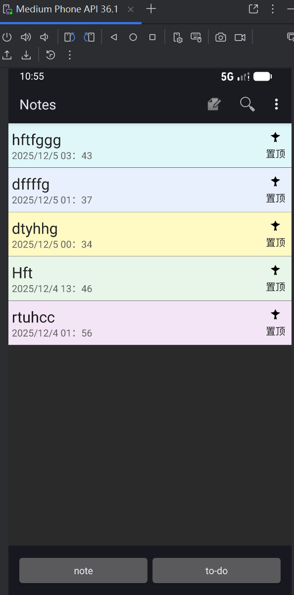

2. 进入新增笔记的页面

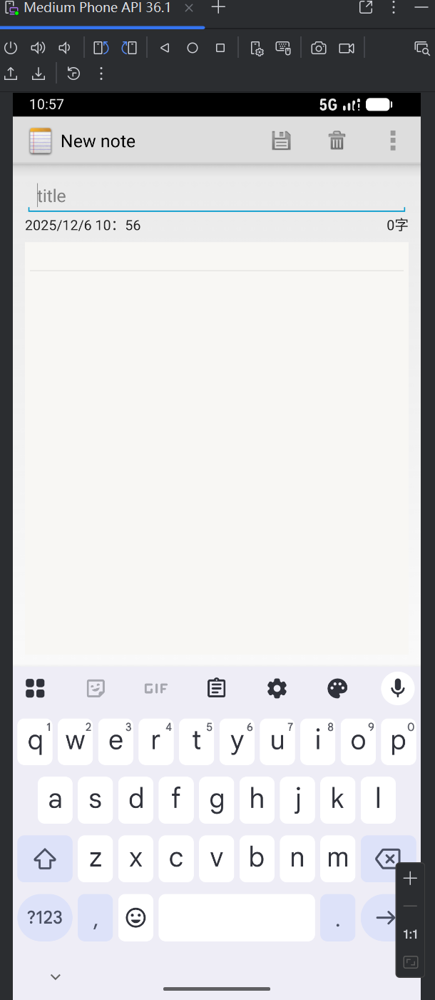

在title处输入笔记的标题内容，接下来在其下方便可输入正文内容，为了让笔记的格式更美观，在笔记的左侧添加了时间戳，格式为2025/12/6 18：35，其会显示当前时间，并且在右下角还会自动统计笔记正文内容的字数。当笔记内容填写完成后，点击右上角第一个按钮便可保存笔记，如果你不需要这个笔记了，点击垃圾桶图标(即第二个按钮便可删除)。

填写完内容后的效果

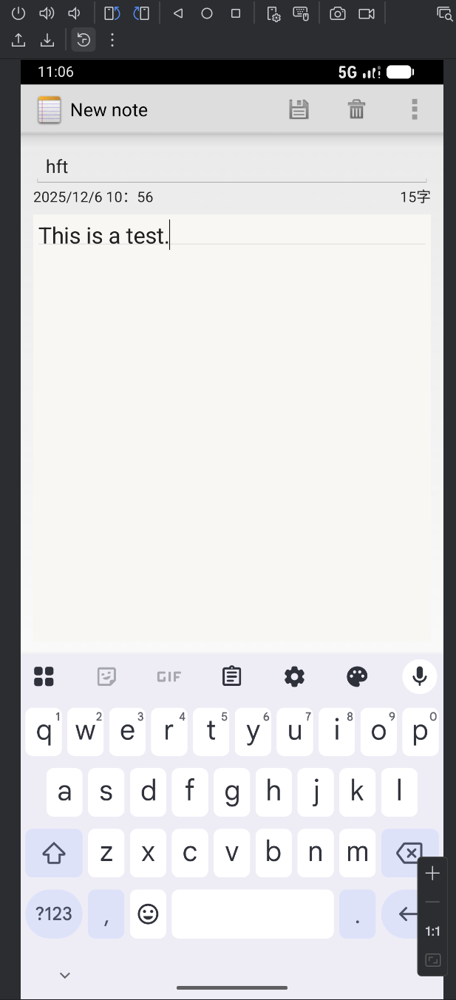

保存以后主界面显示

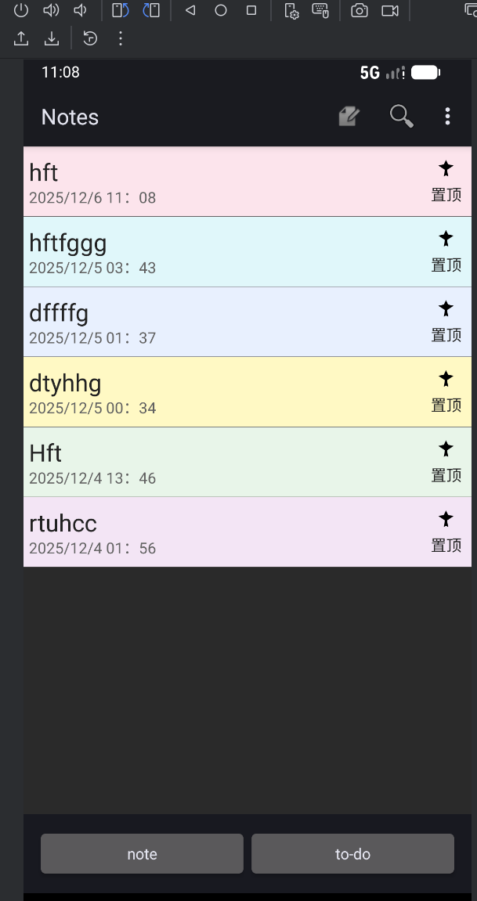

3. 访问一条之前写过的笔记不做任何修改（访问Hft这条笔记）

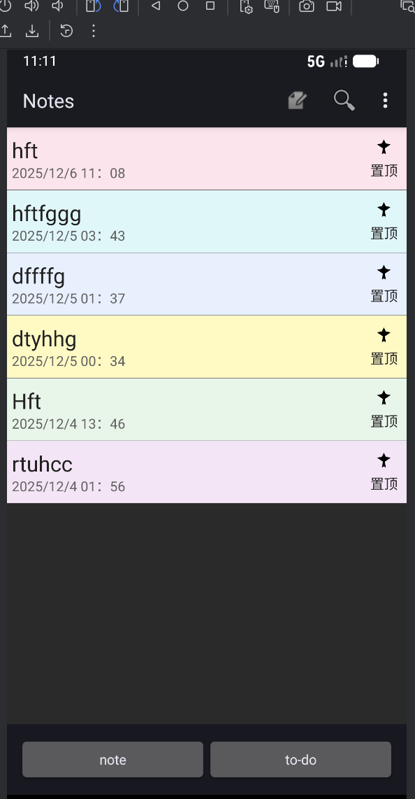

发现访问后笔记的时间戳并未改变，说明修复了前述的bug。

4. 修改一条笔记内容并保存（对rtuhcc这条笔记进行修改）

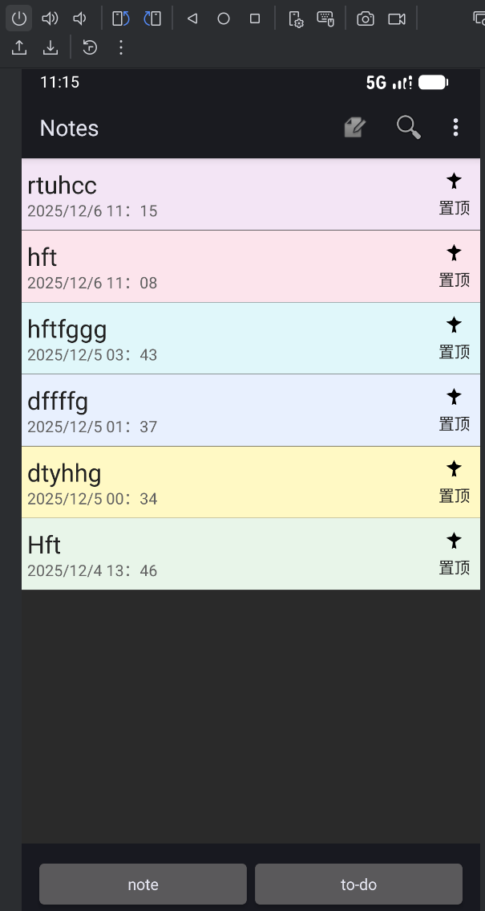

修改并点击保存按钮后，其时间戳更新为其当前完成的时间。


### 2、添加笔记查询功能

(1)功能要求

用户可以根据笔记的标题或者内容来查询笔记，并可点击相应笔记进行查看。

(2)实现思路和核心代码

**实现思路**

- 在笔记列表页使用 SearchView 作为查询输入，实时过滤列表数据

- 过滤通过适配器的 FilterQueryProvider 执行数据库查询，条件为标题或内容模糊匹配

- 查询结果绑定到 ListView / GridView ，点击任一条目进入编辑页查看/编辑

- 数据来源是 ContentProvider 的 Notes 表；查询仅在搜索时变更，正常浏览使用默认排序

**核心代码**

- 搜索控件声明

  - app/src/main/res/menu/list_options_menu.xml:15-19

```java
<item android:id="@+id/menu_search"
      android:icon="@android:drawable/ic_menu_search"
      android:title="@string/menu_search"
      android:showAsAction="always|collapseActionView"
      android:actionViewClass="android.widget.SearchView" />
```

- 适配器与搜索监听
  - 适配器创建： app/src/main/java/com/example/android/notepad/NotesList.java:179-186
  - 绑定搜索监听，将关键字传给适配器过滤： NotesList.java:335-353

```java
MenuItem searchItem = menu.findItem(R.id.menu_search);
if (searchItem != null) {
    View actionView = searchItem.getActionView();
    if (actionView instanceof SearchView) {
        SearchView sv = (SearchView) actionView;
        sv.setOnQueryTextListener(new SearchView.OnQueryTextListener() {
            @Override public boolean onQueryTextSubmit(String q) {
                ((SimpleCursorAdapter) getListAdapter()).getFilter().filter(q);
                return true;
            }
            @Override public boolean onQueryTextChange(String t) {
                ((SimpleCursorAdapter) getListAdapter()).getFilter().filter(t);
                return true;
            }
        });
    }
}
```

- 按标题或内容模糊查询
  - 过滤回调，实现 SQL LIKE 条件： NotesList.java:265-285

```java
FilterQueryProvider fqp = new FilterQueryProvider() {
    @Override public Cursor runQuery(CharSequence constraint) {
        Uri uri = getIntent().getData();
        String selection = null;
        String[] selectionArgs = null;
        if (constraint != null && constraint.length() > 0) {
            String q = "%" + constraint.toString() + "%";
            selection = NotePad.Notes.COLUMN_NAME_TITLE + " LIKE ? OR "
                      + NotePad.Notes.COLUMN_NAME_NOTE  + " LIKE ?";
            selectionArgs = new String[]{ q, q };
        }
        return managedQuery(uri, PROJECTION, selection, selectionArgs, currentSortOrder());
    }
};
adapter.setFilterQueryProvider(fqp);
gridAdapter.setFilterQueryProvider(fqp);
```

- 点击进入查看/编辑
  - 列表点击跳转到 NoteEditor ： NotesList.java:720-740

```java
@Override
protected void onListItemClick(ListView l, View v, int position, long id) {
    Uri uri = ContentUris.withAppendedId(getIntent().getData(), id);
    String action = getIntent().getAction();
    if (Intent.ACTION_PICK.equals(action) || Intent.ACTION_GET_CONTENT.equals(action)) {
        setResult(RESULT_OK, new Intent().setData(uri));
    } else {
        startActivity(new Intent(Intent.ACTION_EDIT, uri));
    }
}
```

**行为说明**

- 输入关键词时，标题与正文任意包含该关键词的笔记都会显示；空关键词显示全部

- 列表与宫格视图共用同一过滤逻辑与数据源

- 点击任意搜索结果即可进入笔记编辑页进行查看或编辑

(3)操作流程及实现效果截图

1. 点击右上角放大镜图标(即第二个按钮)，便会出现如下效果

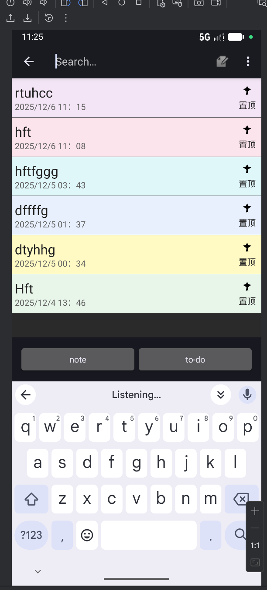

2. 输入你要查询的内容，比如我要查询hft,输入后的效果

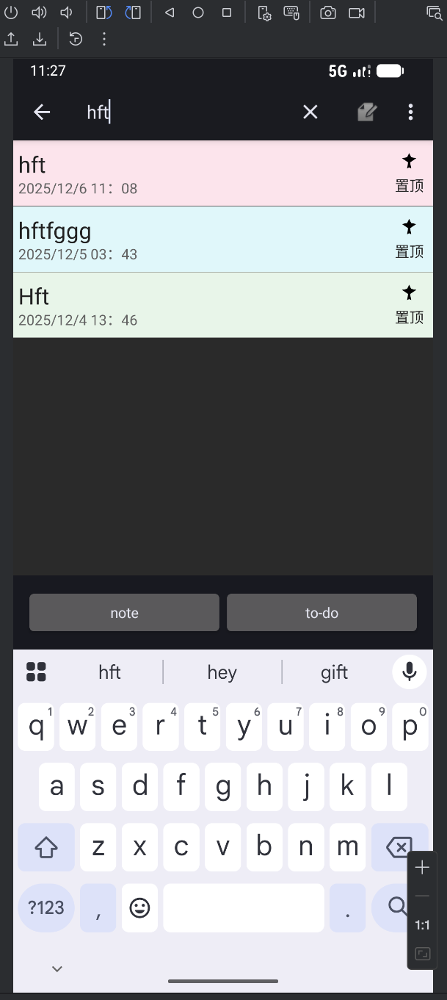

3. 点击查询结果中的笔记，便进入笔记详情页，并显示笔记内容

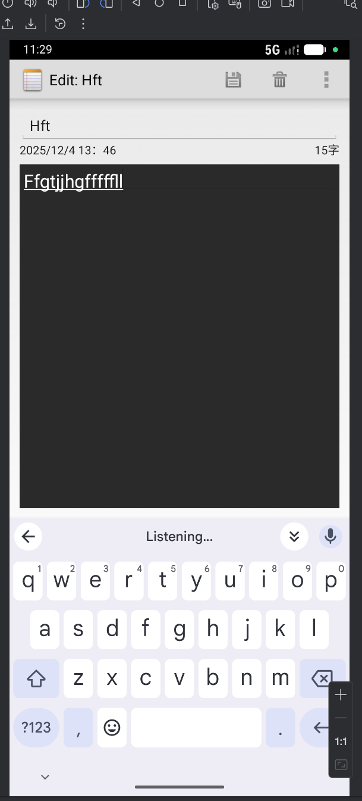


### 3、新增待办功能

(1)功能要求

用户可以增删改查待办事项。

用户可以通过回车来一次创建多条待办事项，同时在设置提醒时间时，程序会自动判断该时间是否过期，如果过期，将提示用户所选时间已过期并不会成功设置过期时间，只有选择正确未来的时间，设置时间按钮处才会显示相应的时间，同时如果用户未输入待办事项内容时，完成按钮将点击无效。

在每条待办事项的右侧都有一个垃圾桶图标按钮，当用户点击该图标按钮时，该待办事项将删除。

用户可以点击其想修改的待办事项，允许用户修改待办事项的内容和重新设置提醒时间。

用户可以通过待办事项的内容进行查询相应的待办事项，并可点击查看相应待办事项的详细内容。

当用户在待办事项中设置提醒时间后，该待办事项左下角会显示其设置的提醒时间，时间格式为12/6 19：48，提醒时间到了后，系统将发送消息通知用户，用户可以点击消息进行查看相应的待办事项内容，当设置的提醒时间过了之后，相应的待办事项也将在其时间戳旁显示已过期。

每一条待办事项左侧都有一个复选框，当用户勾选复选框后，相应的待办事项将列入已完成的待办事项列表中，其颜色也都以浅灰色显示，该列表可以显示已完成的待办事项个数，同时还具有收缩与展开功能。

为了让用户有更好的体验感，每个待办事项都以不同的颜色进行显示，同时还可以对待办事项列表主页面进行主题颜色更换，所采取的颜色都是用户友好型的。

(2)实现思路和核心代码

**实现思路**

- 数据模型使用 NotePad.ToDos 表，字段包含文本、提醒时间毫秒值、完成状态、时间戳等

- 列表页通过两个 SimpleCursorAdapter 分别展示“未完成”和“已完成”待办；点击列表项弹出编辑对话框

- 新增对话框支持回车一次输入多行，逐行解析并批量插入；“完成”按钮在无内容时禁用

- 设置提醒时间使用日期+时间选择器，确认时校验是否过期；仅未来时间才生效，按钮显示格式化时间；列表左下角显示提醒时间，过期则标注“已过期”

- 垃圾桶按钮删除该条待办，同时取消其提醒

- 复选框勾选将待办标记为已完成，颜色、样式变灰并移入已完成列表；支持展开/收缩与已完成数量统计

- 内容查询通过 SearchView 和 FilterQueryProvider 实现；可点击进入详情编辑

- 到时提醒通过 AlarmManager + BroadcastReceiver 发送系统通知，点击通知进入对应待办详情；设备重启后通过开机广播恢复未过期提醒

**核心代码**

- 批量新增与未输入禁用完成
  - 批量预览与解析每行（回车分行），禁用“完成”按钮当没有有效行时： app/src/main/java/com/example/android/notepad/ToDoList.java:365-376

```java
input.addTextChangedListener(new TextWatcher() {
    @Override public void onTextChanged(CharSequence s, int start, int before, int count) {
        previewItems.clear();
        String[] lines = s.toString().split("\n");
        for (String line : lines) {
            String t = line.trim();
            if (t.length() > 0) previewItems.add(t);
        }
        previewAdapter.notifyDataSetChanged();
        btnDone.setEnabled(previewItems.size() > 0);
    }
});
```

- 批量插入与调度未来提醒： ToDoList.java:400-418

```java
btnDone.setOnClickListener(v -> {
    for (String t : previewItems) {
        ContentValues values = new ContentValues();
        values.put(NotePad.ToDos.COLUMN_NAME_TEXT, t);
        if (selectedReminder != null) {
            values.put(NotePad.ToDos.COLUMN_NAME_REMINDER_MILLIS, selectedReminder);
        }
        values.put(NotePad.ToDos.COLUMN_NAME_DONE, 0);
        Uri uri = getContentResolver().insert(NotePad.ToDos.CONTENT_URI, values);
        if (uri != null && selectedReminder != null && selectedReminder > System.currentTimeMillis()) {
            long id = ContentUris.parseId(uri);
            scheduleReminder(id, selectedReminder);
        }
    }
    refreshLists();
    dialog.dismiss();
});
```

- 设置提醒与过期校验
  - 选择日期时间后，弹出确认对话框，校验过期并更新按钮文本： ToDoList.java:636-677 与 661-669

```java
pickReminder(() -> {
    if (selectedReminder != null) {
        btnSetReminder.setText(formatReminder(selectedReminder));
        previewAdapter.notifyDataSetChanged();
    } else {
        btnSetReminder.setText("设置提醒");
        previewAdapter.notifyDataSetChanged();
    }
});
```

```java
if (millis <= System.currentTimeMillis()) {
    Toast.makeText(ToDoList.this, "所选时间已过期", Toast.LENGTH_LONG).show();
    selectedReminder = null;
} else {
    selectedReminder = millis;
}
```

- 提醒时间格式（左下角）与“已过期”标记： ToDoList.java:105-119 、 680-682

```java
if (millis > 0) {
    String t = formatReminder(millis); // "M/d HH：mm"
    if (millis <= System.currentTimeMillis()) t = t + "  已过期";
    tv.setText(t);
} else {
    tv.setText("");
}
```

- 删除与垃圾桶图标
  - 每条右侧垃圾桶按钮删除该待办并取消提醒： ToDoList.java:136-144

```java
final long id = c.getLong(c.getColumnIndex(NotePad.ToDos._ID));
view.setOnClickListener(v2 -> {
    cancelReminder(id);
    getContentResolver().delete(ContentUris.withAppendedId(NotePad.ToDos.CONTENT_ID_URI_BASE, id), null, null);
    Cursor cur = ((SimpleCursorAdapter) listView.getAdapter()).getCursor();
    if (cur != null) cur.requery();
});
```

- 编辑待办、重设提醒与过期处理
  - 点击列表项弹出编辑对话框： ToDoList.java:235-246
  - 编辑保存逻辑：空内容不保存，未来时间调度提醒，过去时间取消提醒： ToDoList.java:520-540

```java
String t = input.getText().toString().trim();
if (t.length() == 0) return;
ContentValues values = new ContentValues();
values.put(NotePad.ToDos.COLUMN_NAME_TEXT, t);
values.put(NotePad.ToDos.COLUMN_NAME_MODIFICATION_DATE, System.currentTimeMillis());
if (selectedReminder != null) values.put(NotePad.ToDos.COLUMN_NAME_REMINDER_MILLIS, selectedReminder);
else values.putNull(NotePad.ToDos.COLUMN_NAME_REMINDER_MILLIS);
getContentResolver().update(ContentUris.withAppendedId(NotePad.ToDos.CONTENT_ID_URI_BASE, todoId), values, null, null);
if (selectedReminder != null && selectedReminder > System.currentTimeMillis()) {
    scheduleReminder(todoId, selectedReminder);
} else {
    cancelReminder(todoId);
}
```

- 内容查询与点击查看
  - 仅按内容模糊查询，返回游标动态刷新： ToDoList.java:262-285

```java
adapter.setFilterQueryProvider(constraint -> {
    String selection = null; String[] args = null;
    if (constraint != null && constraint.length() > 0) {
        String q = "%" + constraint.toString() + "%";
        selection = NotePad.ToDos.COLUMN_NAME_TEXT + " LIKE ?";
        args = new String[]{ q };
    }
    return managedQuery(NotePad.ToDos.CONTENT_URI,
        new String[]{ NotePad.ToDos._ID, NotePad.ToDos.COLUMN_NAME_TEXT, NotePad.ToDos.COLUMN_NAME_REMINDER_MILLIS, NotePad.ToDos.COLUMN_NAME_DONE },
        selection, args, NotePad.ToDos.DEFAULT_SORT_ORDER);
});
```

- 提醒到时通知与点击查看
  - 调度与取消提醒： ToDoList.java:546-569 （ AlarmManager 分版本精确设置）
  - 到时广播发送通知，点击进入 ToDoList 指向该条待办： app/src/main/java/com/example/android/notepad/TodoReminderReceiver.java:13-47

```java
Intent open = new Intent(context, ToDoList.class);
open.putExtra("todo_id", id);
PendingIntent content = PendingIntent.getActivity(context, (int) id, open, PendingIntent.FLAG_UPDATE_CURRENT);
Notification.Builder builder = new Notification.Builder(context)
    .setSmallIcon(R.drawable.app_notes)
    .setContentTitle("待办提醒")
    .setContentText(text)
    .setAutoCancel(true)
    .setContentIntent(content);
builder.setDefaults(Notification.DEFAULT_ALL);
nm.notify((int) id, builder.build());
```

(3)操作流程及实现效果截图

1. 点击主界面下方的to-do按钮，便进入待办事项列表界面

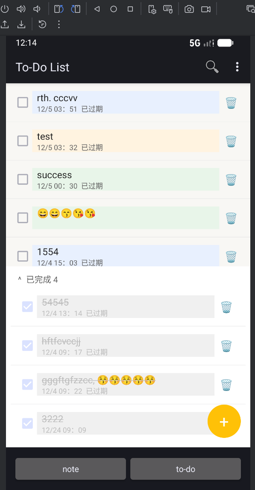

2. 点击右下角的橙色按钮便可新增待办事项

3. 输入待办事项内容，设置提醒时间(这个为可选项)，点击完成按钮，便新增成功

新增一条待办事项且不设提醒时间

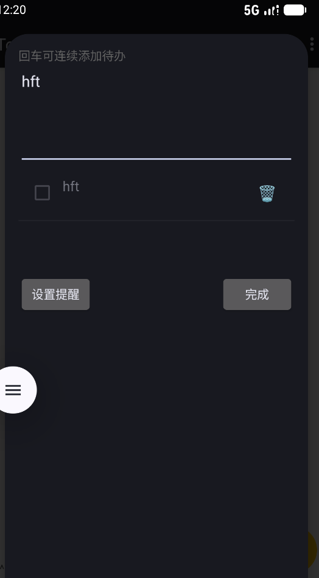

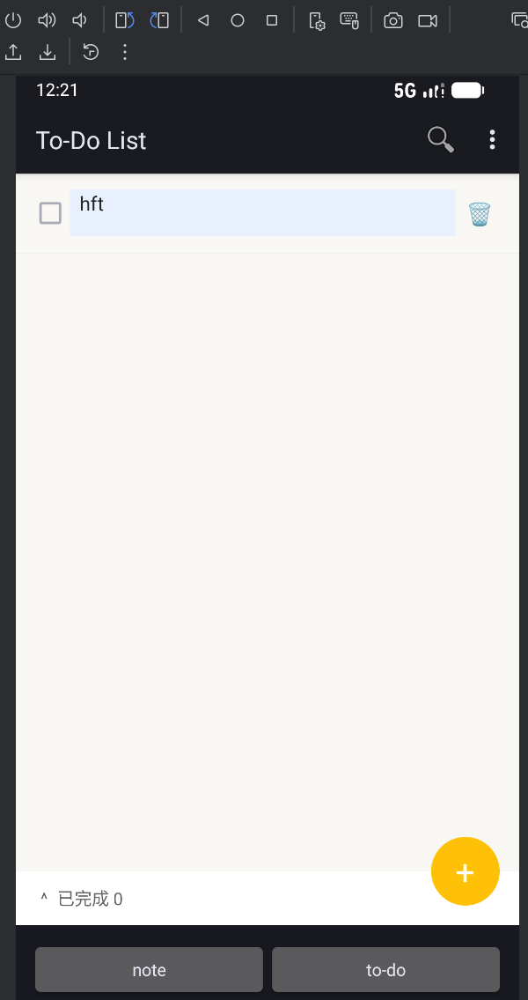

新增多条没设提醒时间的待办事项

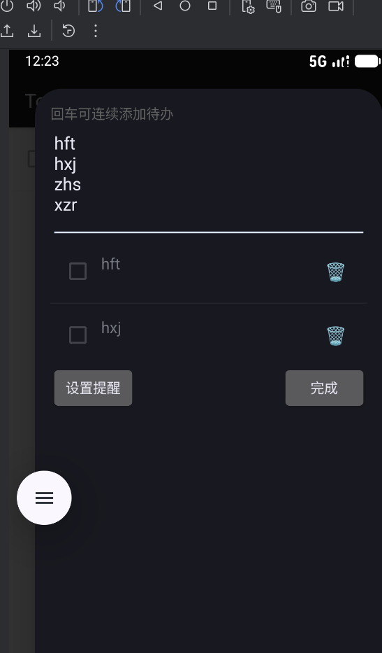

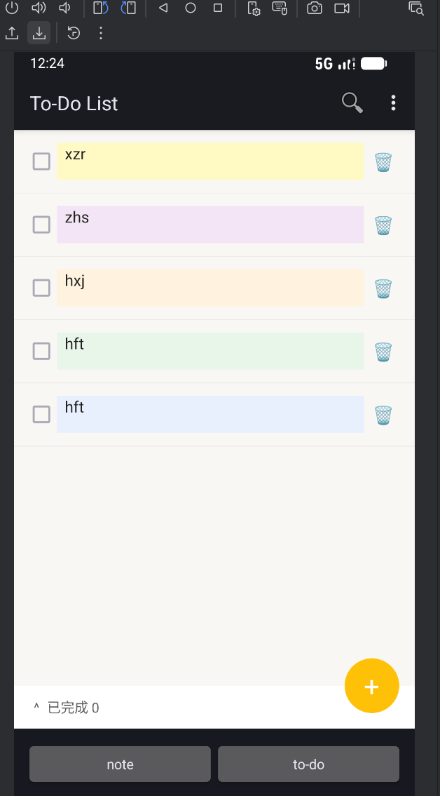

新增一条设有提醒时间的待办事项

选择提醒的年月日

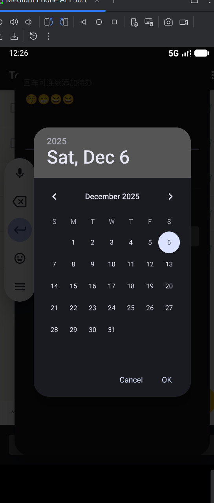

选择具体时间

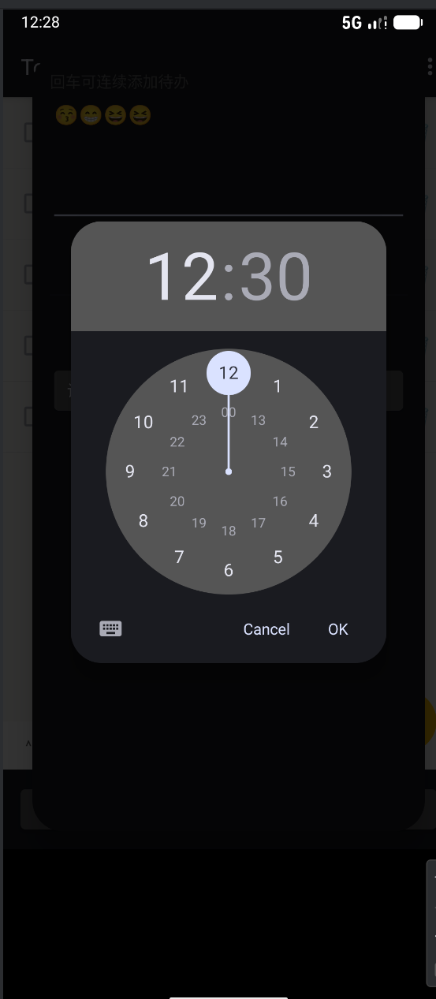

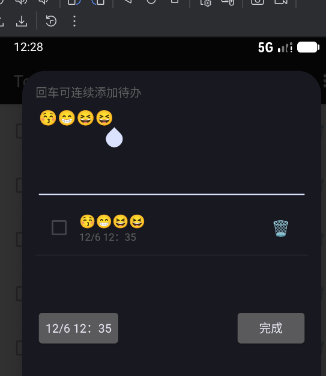


可以发现，只有当设置了提醒时间后，相应的待办事项左下角才会显示提醒时间的时间戳并且在新增时，设置提醒的按钮变成相应设计的提醒时间。

4. 点击待办事项右侧的删除按钮，比如删除xzr的待办事项

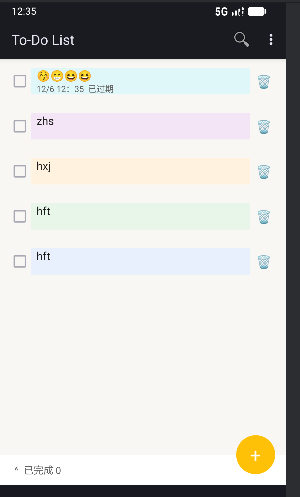

5. 点击任意一条要修改的待办事项，比如点击hft这条待办事项，修改其内容并设置提醒时间

修改情况

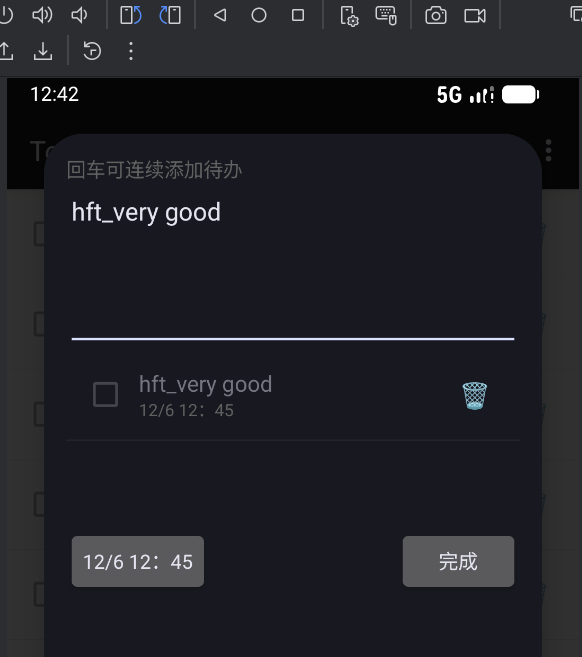

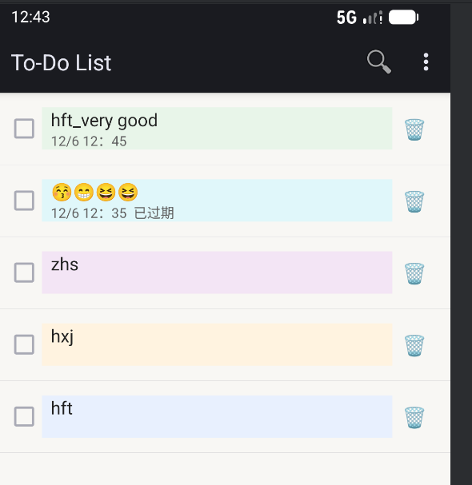

6. 点击右上角放大镜图标按钮(即第一个按钮)，输入要查询的内容，比如查询hft，输入后的效果

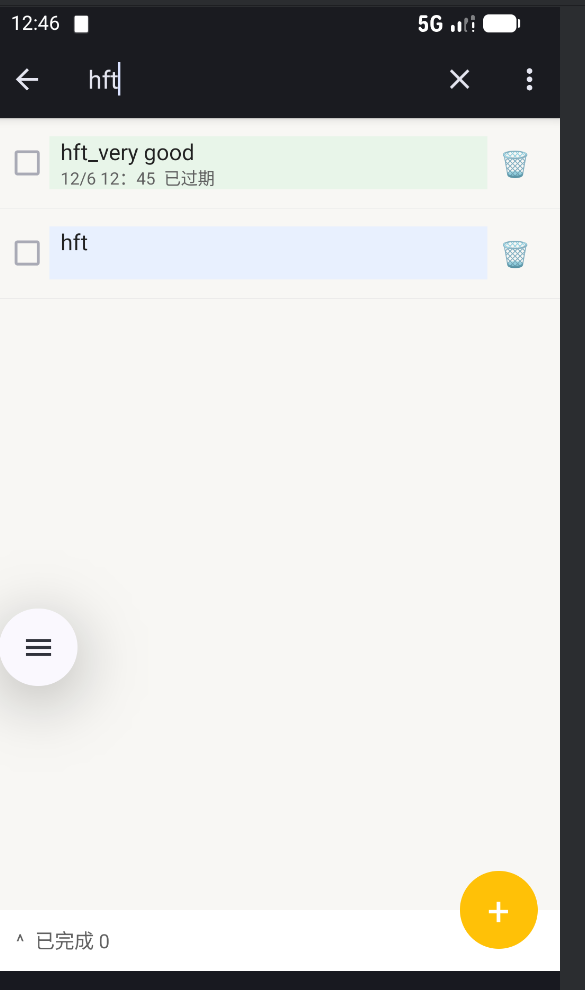

点击你想要的待办事项，便可显示相应的待办事项详情页

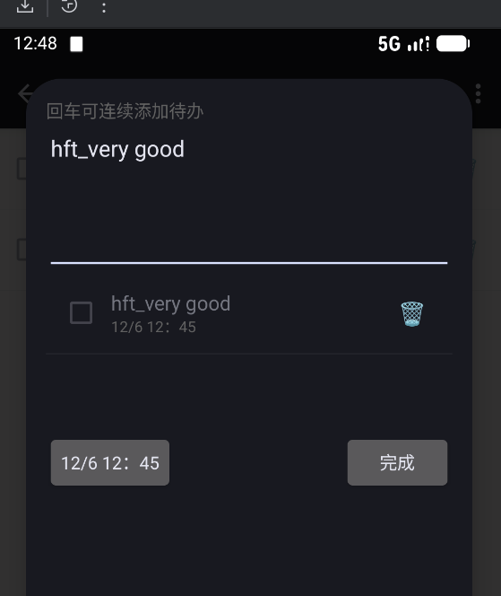

7. 设置了提醒时间的待办事项到点后发送消息提醒，点击消息查看待办事项详情，及过了提醒时间后的待办事项变化效果

程序发送消息提醒

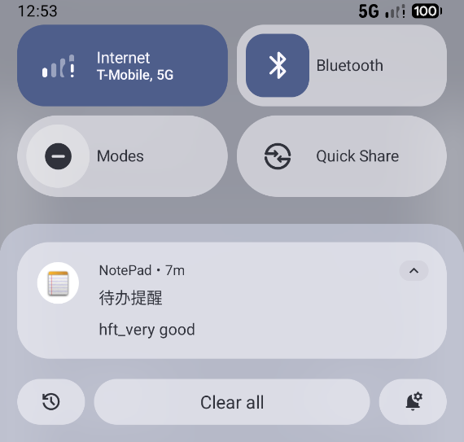

点击查看详情

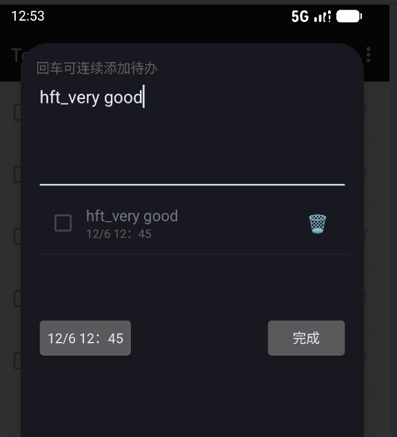

过了提醒时间后的待办事项变化

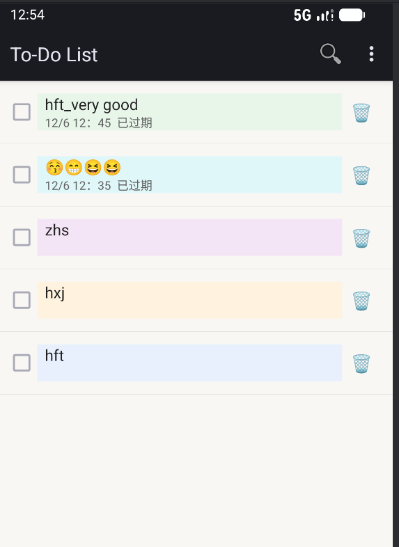

8. 点击已完成的待办事项左侧的复选框后的效果

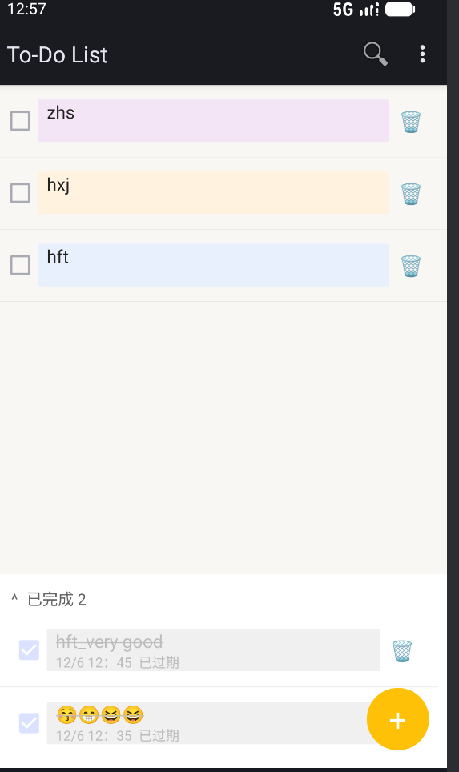

已完成的待办事项都变成了浅灰色且列入已完成列表中，列表展示了已完成待办事项个数

9. 点击已完成列表左侧的^图标按钮便可收缩已完成待办事项列表至程序底部，再次点击便可展开

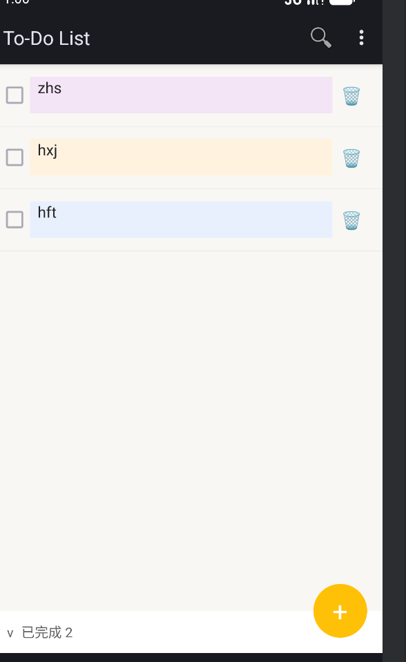

10. 点击右上角三个点的图标按钮，选择Change Theme，便可更换主题颜色

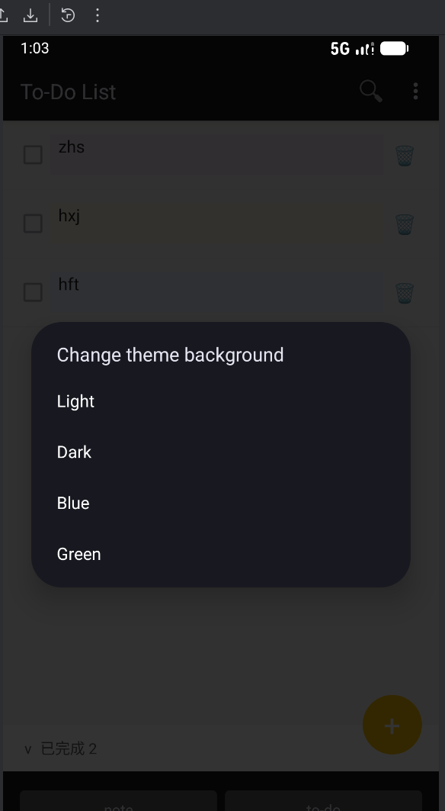

选择要更换的主题颜色，比如选择Dark

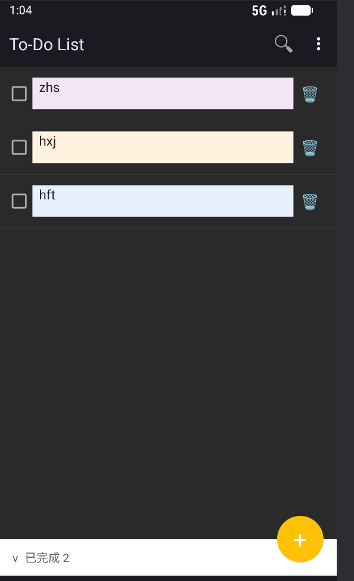


### 4、新增笔记置顶功能

(1)功能要求

用户可以将自己认为重要的笔记进行置顶，置顶的笔记会显示在笔记列表的最上方，如果取消了置顶笔记将回到原来的排序位置。

(2)实现思路和核心代码

**实现思路**

- 在 Notes 表增加 pinned 列，使用 0/1 表示是否置顶

- 列表页根据 pinned 优先排序，置顶笔记始终排在前面，其次按时间排序

- 在 NotesList 的每个条目右侧提供置顶/取消置顶的按钮与图标，点击后更新 pinned 字段并刷新列表

**核心代码**

- 置顶切换与刷新
  - 绑定置顶按钮的显示与点击切换逻辑（ app/src/main/java/com/example/android/notepad/NotesList.java:219-244 ）

```java
} else if (view.getId() == R.id.btn_pin) {
    int pinned = 0;
    try { pinned = cursor.getInt(columnIndex); } catch (Exception ignored) {}
    android.widget.TextView btn = (android.widget.TextView) view;
    btn.setText(pinned != 0 ? "取消置顶" : "置顶");

    View container = ((View) view.getParent());
    View iconView = container.findViewById(R.id.pin_icon);
    if (iconView instanceof android.widget.ImageView) {
        ((android.widget.ImageView) iconView).setImageResource(
            pinned != 0 ? R.drawable.ic_unpin : R.drawable.ic_pin);
    }

    int idCol = cursor.getColumnIndex(NotePad.Notes._ID);
    final long noteId = idCol != -1 ? cursor.getLong(idCol) : -1;
    final int pinnedValue = pinned;

    View.OnClickListener toggle = new View.OnClickListener() {
        @Override public void onClick(View v) {
            ContentValues values = new ContentValues();
            values.put(NotePad.Notes.COLUMN_NAME_PINNED, pinnedValue != 0 ? 0 : 1);
            getContentResolver().update(
                ContentUris.withAppendedId(NotePad.Notes.CONTENT_ID_URI_BASE, noteId),
                values, null, null);
            ((SimpleCursorAdapter) getListAdapter()).getCursor().requery();
        }
    };
    btn.setOnClickListener(toggle);
    container.setOnClickListener(toggle);
    if (iconView != null) iconView.setOnClickListener(toggle);
    return true;
}
```

(3)操作流程及实现效果截图

1. 点击任一条需要置顶的笔记右侧的置顶按钮，比如对Hft笔记进行置顶

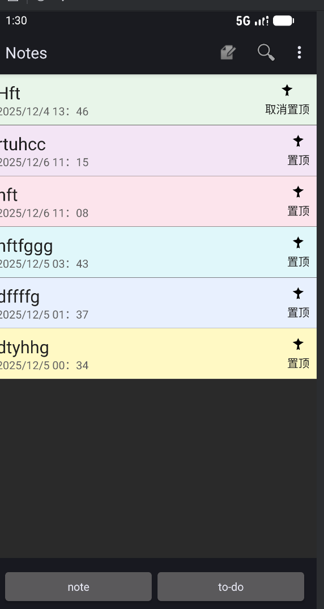

2. 点击取消置顶按钮，笔记便会取消置顶，回到原来的排序位置

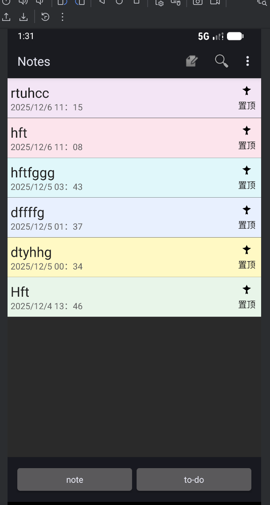


### 5、UI美化及笔记本偏好设置

(1)功能要求

用户可以根据个人喜好更改笔记列表主题背景颜色，更改笔记内容背景颜色，选择笔记的表格布局(包含列表模式和宫格模式)，选择笔记的排序方式(包括按创建日期排序和按编辑日期排序)，选择文字大小(可选小、默认、大、超大四种字体大小)，同时为了笔记更加美观，对每一条笔记都设计了不同的颜色进行显示。

(2)实现思路和核心代码

**实现思路**

主题与颜色

- 列表主题背景更换
  - 菜单入口与选择器： app/src/main/java/com/example/android/notepad/NotesList.java:743-755
  - 主题应用与持久化： NotesList.java:757-766 、 NotesList.java:768-801
  - 关键点：切换 Light/Dark/Blue/Green，设置列表背景、分隔线颜色，并调用 invalidateViews() 刷新
- 笔记内容背景更换
  - 菜单入口： app/src/main/java/com/example/android/notepad/NoteEditor.java:674-686
  - 应用与保存（按笔记ID持久化）： NoteEditor.java:688-700
  - 主题应用： NoteEditor.java:702-731 ，设置 EditText 背景与文字颜色，信息栏颜色同步
- 单条笔记多彩显示
  - 列表项随机柔色背景（按笔记ID取模）： app/src/main/java/com/example/android/notepad/NotesList.java:72-81 与绑定逻辑 NotesList.java:188-214
  - 效果：每条笔记卡片背景在 Pastel 色系轮换，保证标题与时间颜色可读

布局选择（列表/宫格）

- 布局选择器： app/src/main/java/com/example/android/notepad/NotesList.java:502-514
- 持久化与应用： NotesList.java:293-305
- 实现要点：
  - 同时构建 ListView 和 GridView 两套 SimpleCursorAdapter （ NotesList.java:179-186 、 NotesList.java:254-264 ），共用 ViewBinder （ NotesList.java:262-263 ）
  - 根据偏好切换 Visibility ，不重复查询，提高切换效率

排序方式（创建/编辑时间）

- 排序选择器： app/src/main/java/com/example/android/notepad/NotesList.java:534-547
- 当前排序生成： NotesList.java:517-522
- 刷新适配器： NotesList.java:524-532
- 规则：先按 pinned DESC 再按所选时间列 created 或 modified 倒序

文字大小（小/默认/大/超大）

- 字号选择器： app/src/main/java/com/example/android/notepad/NotesList.java:549-563
- 偏好应用到编辑页： app/src/main/java/com/example/android/notepad/NoteEditor.java:294-299
- 说明：列表页设置全局偏好 note_font_size_sp ，编辑页启动时读取并设置 EditText 的 SP 字号

**核心代码**

- 列表主题应用与保存

```java
private void applySavedTheme() { // 757-761
    SharedPreferences prefs = getSharedPreferences("notepad_prefs", MODE_PRIVATE);
    int which = prefs.getInt("noteslist_theme", 0);
    applyTheme(which);
}
private void saveTheme(int which) { // 763-766
    SharedPreferences prefs = getSharedPreferences("notepad_prefs", MODE_PRIVATE);
    prefs.edit().putInt("noteslist_theme", which).apply();
}
private void applyTheme(int which) { // 768-801
    int res, dividerColor;
    switch (which) { /* Light/Dark/Blue/Green -> res & dividerColor */ }
    getListView().setBackgroundResource(res);
    getListView().setDivider(new ColorDrawable(dividerColor));
    getListView().invalidateViews();
}
```

- 笔记内容主题（按笔记）

```java
private void applySavedNoteTheme() { // 688-694
    if (mUri == null) return;
    long id = ContentUris.parseId(mUri);
    int which = getSharedPreferences("notepad_prefs", MODE_PRIVATE).getInt("note_theme_" + id, 0);
    applyNoteTheme(which);
}
private void saveNoteTheme(int which) { // 696-700
    long id = ContentUris.parseId(mUri);
    getSharedPreferences("notepad_prefs", MODE_PRIVATE).edit().putInt("note_theme_" + id, which).apply();
}
private void applyNoteTheme(int which) { // 702-731
    int res, infoColor; /* switch which -> bg & colors */
    mText.setBackgroundResource(res);
    mText.setTextColor(mEditorTextColor);
    if (mTimestampView != null) mTimestampView.setTextColor(infoColor);
}
```

- 布局模式切换与应用

```java
private void applySavedLayoutMode() { // 293-305
    int mode = getSharedPreferences("notepad_prefs", MODE_PRIVATE).getInt("noteslist_layout", 0);
    GridView grid = findViewById(R.id.grid_notes);
    ListView list = getListView();
    if (mode == 1) { list.setVisibility(View.GONE); grid.setVisibility(View.VISIBLE); }
    else { grid.setVisibility(View.GONE); list.setVisibility(View.VISIBLE); }
}
private void showLayoutChooser() { // 502-514
    new AlertDialog.Builder(this).setTitle("笔记表格布局").setItems(new String[]{"列表模式","宫格模式"},
        (d, which) -> { getSharedPreferences("notepad_prefs", MODE_PRIVATE).edit().putInt("noteslist_layout", which == 1 ? 1 : 0).apply(); applySavedLayoutMode(); }).show();
}
```
- 排序选择与规则

```java
private String currentSortOrder() { // 517-522
    int sort = getSharedPreferences("notepad_prefs", MODE_PRIVATE).getInt("noteslist_sort", 1);
    String base = sort == 0 ? NotePad.Notes.COLUMN_NAME_CREATE_DATE : NotePad.Notes.COLUMN_NAME_MODIFICATION_DATE;
    return "pinned DESC, " + base + " DESC";
}
private void showSortChooser() { // 534-547
    new AlertDialog.Builder(this).setTitle("排序方式")
        .setItems(new String[]{"按创建日期排序", "按编辑日期排序"},
            (d, which) -> { getSharedPreferences("notepad_prefs", MODE_PRIVATE).edit().putInt("noteslist_sort", which == 0 ? 0 : 1).apply(); refreshAdaptersSorted(); })
        .show();
}
```

- 文字大小设置与应用

```java
private void showFontSizeChooser() { // 549-563
    final String[] items = new String[]{"小","默认","大","超大"};
    final int[] sizes = new int[]{16, 22, 26, 30};
    new AlertDialog.Builder(this).setTitle("文字大小").setItems(items,
        (d, which) -> getSharedPreferences("notepad_prefs", MODE_PRIVATE).edit().putInt("note_font_size_sp", sizes[which]).apply()).show();
}
```

```java
private void applySavedFontSize() { // 294-299
    int sp = getSharedPreferences("notepad_prefs", MODE_PRIVATE).getInt("note_font_size_sp", 22);
    mText.setTextSize(TypedValue.COMPLEX_UNIT_SP, sp);
}
```

- 每条笔记多彩显示（列表项）

```java
private final int[] ITEM_COLORS = new int[] { /* Pastel colors */ }; // 72-81
adapter.setViewBinder((view, cursor, columnIndex) -> { // 188-214
    if (view.getId() == R.id.timestamp) {
        long millis = cursor.getLong(columnIndex);
        TextView tv = (TextView) view;
        int idCol = cursor.getColumnIndex(NotePad.Notes._ID);
        long noteId = idCol != -1 ? cursor.getLong(idCol) : 0;
        int idx = (int) (Math.abs(noteId) % ITEM_COLORS.length);
        View parent = (View) view.getParent();
        parent.setBackgroundColor(ITEM_COLORS[idx]);
        tv.setTextColor(Color.parseColor("#616161"));
        return true;
    }
    return false;
});
```

(3)操作流程及实现效果截图

1. 点击右上角三个点图标按钮，选择Change theme background，选择一个想要的颜色便可更换主题背景颜色

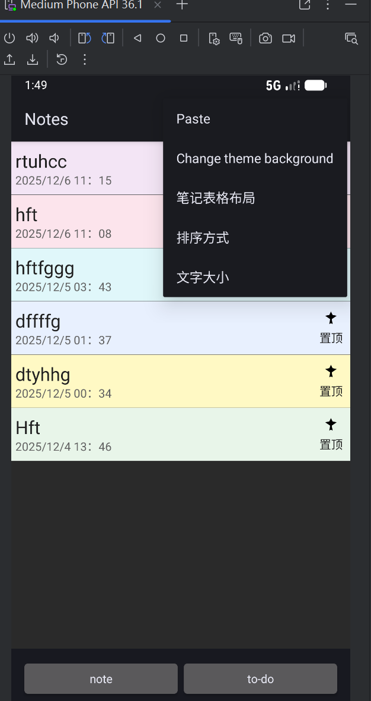

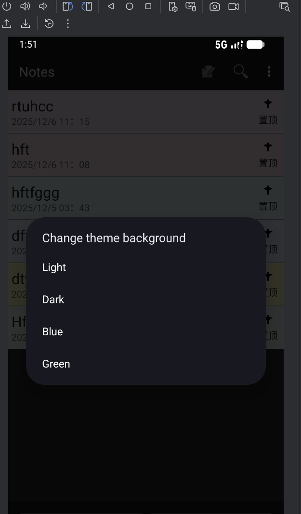

比如选择Green，其呈现的效果

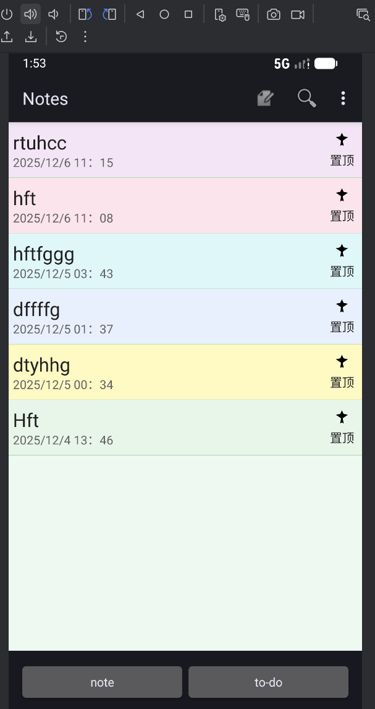

2. 点击右上角三个点图标按钮，选择笔记格式布局，当前笔记以列表模式进行布局，选择宫格模式后呈现的效果

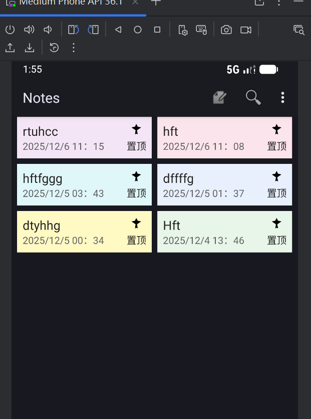

3. 点击右上角三个点图标按钮，选择排序方式，当前排序方式为按编辑日期排序，选择按创建日期排序后呈现的效果

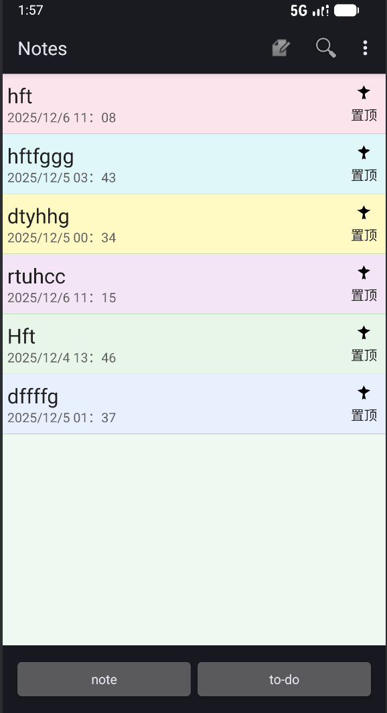

4. 点击右上角三个点图标按钮，选择文字大小，当前文字大小为默认，选择超大和小后呈现的效果

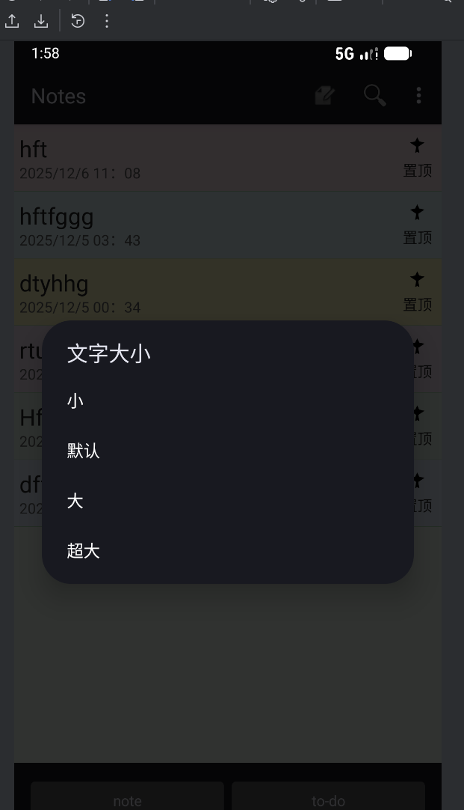

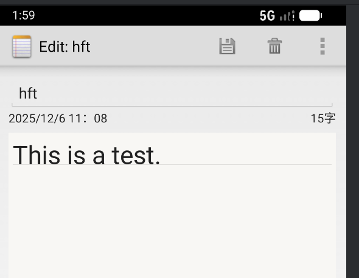

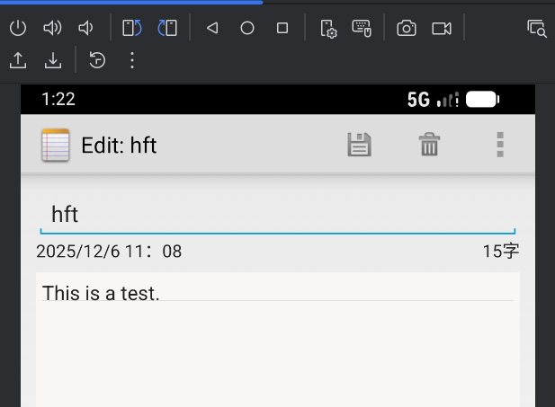

5. 点击任意一条想修改内容背景的笔记，点击笔记内右上角三个点图标按钮，选择Change note theme background,选择一个想要的颜色即可更换笔记内容背景颜色。以hft笔记为例，选择Blue，其呈现的效果

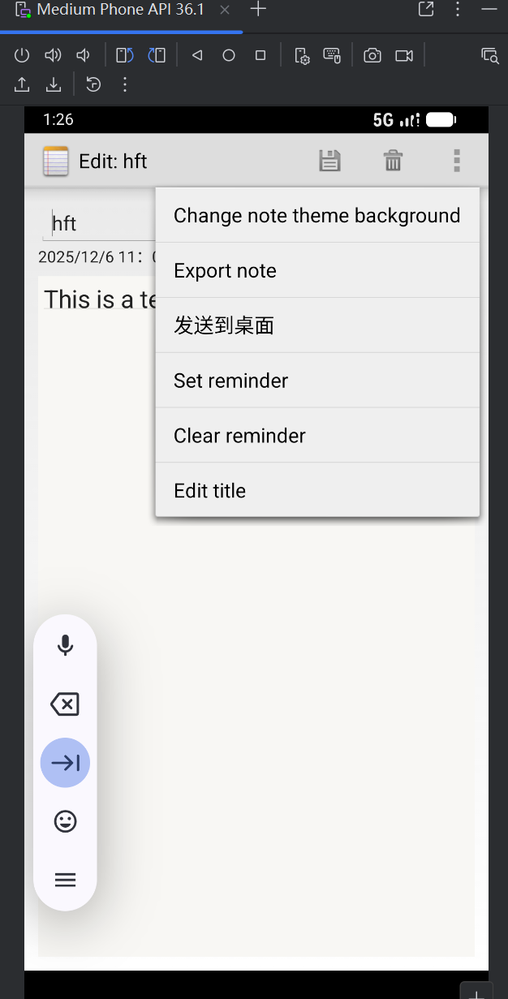

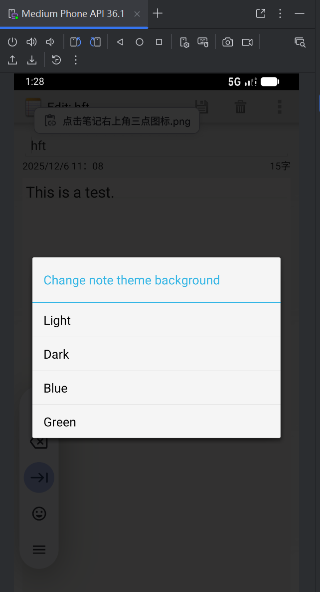

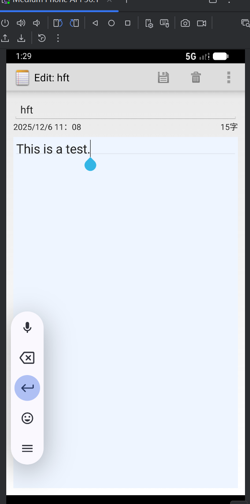


### 6、笔记导出功能

(1)功能要求

用户可以将重要的笔记导出为txt文件、图片文件、Markdown文件三种形式，方便用户保存，并分享给其他用户。

(2)实现思路和核心代码

**实现思路**

- 在编辑页提供三种导出方式：纯文本（TXT）、渲染为图片（PNG）、Markdown（MD）

- 导出操作从当前笔记标题与内容读取，生成友好的文件名并保存到应用的外部文件目录 exports 下

- 图片导出使用 StaticLayout 将文本绘制到 Bitmap ，确保在不同宽度下排版稳定

- 所有导出成功/失败通过 Toast 提示路径或错误信息

**核心代码**

- TXT 导出（写入 UTF-8 文本）
  - 位置： NoteEditor.java:775-790

```java
private void exportTxt() {
    String title = getCurrentTitle();
    String text = mText.getText().toString();
    String ts = new SimpleDateFormat("yyyyMMdd_HHmmss").format(new Date());
    File out = new File(getExportDir(), safeName(title) + "_" + ts + ".txt");
    try {
        FileOutputStream fos = new FileOutputStream(out);
        OutputStreamWriter osw = new OutputStreamWriter(fos, "UTF-8");
        osw.write(text);
        osw.flush();
        osw.close();
        Toast.makeText(this, "Exported: " + out.getAbsolutePath(), Toast.LENGTH_LONG).show();
    } catch (Exception e) {
        Toast.makeText(this, "Export failed", Toast.LENGTH_LONG).show();
    }
}
```

- 图片导出（将文本绘制到 Bitmap）
  - 位置： NoteEditor.java:797-826

```java
private void exportImage() {
    String title = getCurrentTitle();
    String text = mText.getText().toString();
    int width = mText.getWidth();
    if (width <= 0) width = getResources().getDisplayMetrics().widthPixels - dp(16);
    TextPaint tp = new TextPaint();
    tp.setColor(mEditorTextColor != 0 ? mEditorTextColor : Color.parseColor("#212121"));
    tp.setTextSize(mText.getTextSize());
    StaticLayout layout = new StaticLayout(text, tp, width - dp(32),
        Layout.Alignment.ALIGN_NORMAL, 1.3f, 0, false);
    int bmpW = width;
    int bmpH = layout.getHeight() + dp(32);
    Bitmap bmp = Bitmap.createBitmap(bmpW, bmpH, Bitmap.Config.ARGB_8888);
    Canvas canvas = new Canvas(bmp);
    canvas.drawColor(Color.WHITE);
    canvas.save();
    canvas.translate(dp(16), dp(16));
    layout.draw(canvas);
    canvas.restore();
    String ts = new SimpleDateFormat("yyyyMMdd_HHmmss").format(new Date());
    File out = new File(getExportDir(), safeName(title) + "_" + ts + ".png");
    try {
        FileOutputStream fos = new FileOutputStream(out);
        bmp.compress(Bitmap.CompressFormat.PNG, 100, fos);
        fos.flush();
        fos.close();
        Toast.makeText(this, "Exported: " + out.getAbsolutePath(), Toast.LENGTH_LONG).show();
    } catch (Exception e) {
        Toast.makeText(this, "Export failed", Toast.LENGTH_LONG).show();
    }
}
```

- Markdown 导出（标题作为一级标题）
  - 位置： NoteEditor.java:828-844

```java
private void exportMarkdown() {
    String title = getCurrentTitle();
    String text = mText.getText().toString();
    String md = "# " + title + "\n\n" + text + "\n";
    String ts = new SimpleDateFormat("yyyyMMdd_HHmmss").format(new Date());
    File out = new File(getExportDir(), safeName(title) + "_" + ts + ".md");
    try {
        FileOutputStream fos = new FileOutputStream(out);
        OutputStreamWriter osw = new OutputStreamWriter(fos, "UTF-8");
        osw.write(md);
        osw.flush();
        osw.close();
        Toast.makeText(this, "Exported: " + out.getAbsolutePath(), Toast.LENGTH_LONG).show();
    } catch (Exception e) {
        Toast.makeText(this, "Export failed", Toast.LENGTH_LONG).show();
    }
}
```

文件命名与存储

- 获取当前笔记标题与内容、生成安全文件名、带时间戳后缀：
  - 获取标题： NoteEditor.java:752-760
  - 文件名清理非法字符： NoteEditor.java:762-767
  - 导出目录（应用外部文件路径下的 exports 子目录）： NoteEditor.java:769-773

```java
private String getCurrentTitle() { /* 752-760: 从游标读 title，默认 "note" */ }
private String safeName(String s) { /* 762-767: 替换非法文件名字符为 '_' */ }
private File getExportDir() { /* 769-773: getExternalFilesDir("exports") */ }
```

导出入口选择

- 弹窗入口方法： NoteEditor.java:733-750

```java
private void showExportChooser() {
    final String[] items = new String[]{"Export as TXT", "Export as Image", "Export as Markdown"};
    new AlertDialog.Builder(this)
        .setTitle(R.string.menu_export_note)
        .setItems(items, (dialog, which) -> {
            if (which == 0) exportTxt();
            else if (which == 1) exportImage();
            else if (which == 2) exportMarkdown();
        })
        .show();
}
```

**补充说明**

- 图片导出采用 StaticLayout 控制段落布局，确保长文换行效果稳定；画布背景设为白色，边距通过 dp() 方法设置（ NoteEditor.java:792-795 ）

- 所有导出方法均在结束时通过 Toast 提示结果路径或失败信息，便于用户确认

- 这些导出功能在笔记编辑页中调用，不涉及额外权限；文件保存到应用私有的外部目录，便于用户在文件管理器中访问该路径

(3)操作流程及实现效果截图

1. 点击任意一条笔记，点击笔记内右上角三个点图标按钮，选择Export note，选择Export as txt

2. 点击任意一条笔记，点击笔记内右上角三个点图标按钮，选择Export note，选择Export as image

3. 点击任意一条笔记，点击笔记内右上角三个点图标按钮，选择Export note，选择Export as Markdown

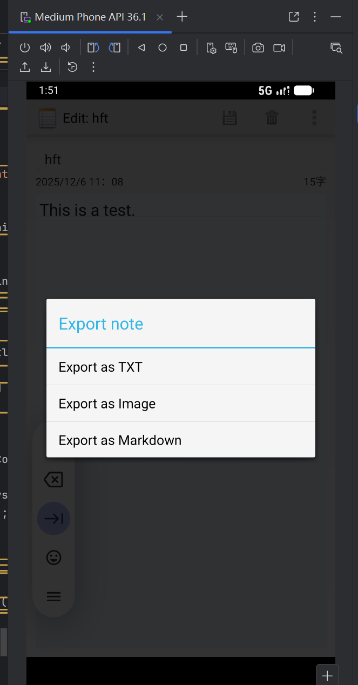

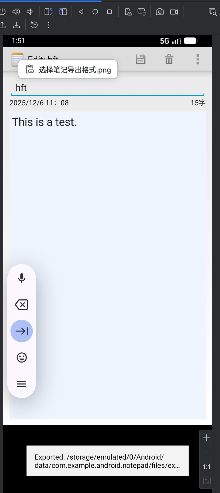

4. 根据提示找到SD卡相应的文件夹，查看导出的笔记文件

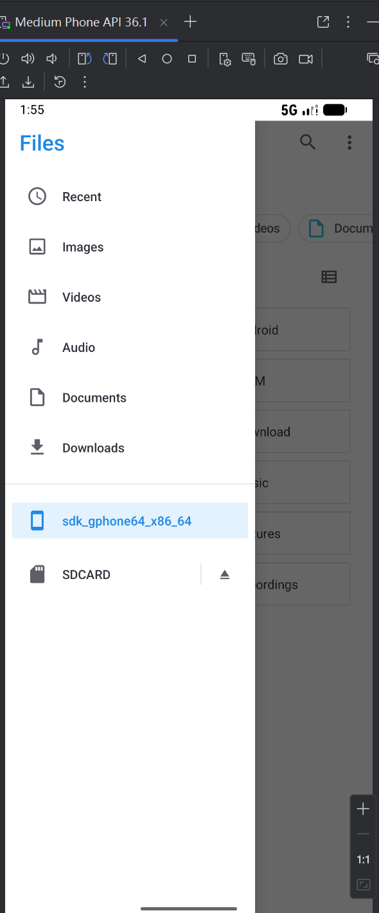

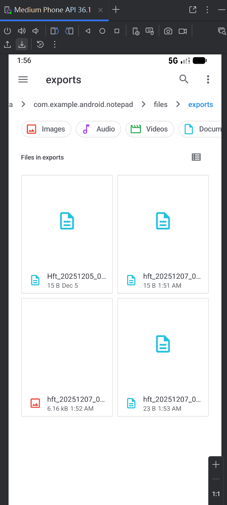

可以看到，笔记内容已保存为txt文件、图片文件、Markdown文件三种形式。

5. 打开导出的笔记文件，查看笔记内容

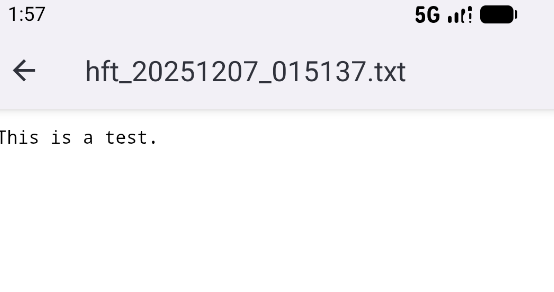


Markdown形式导出的文件手机不支持打开，所以这里不进行展示。


### 7、设置手机桌面笔记便签

(1)功能要求

用户可以将笔记发送至手机桌面形成笔记便签，笔记便签可以选择小尺寸、中尺寸、大尺寸的形式进行显示，通过Widgets将笔记便签添加至桌面。同时为了用户有更好的体验感，每个笔记便签都以不同的颜色显示，用户还可以长按笔记便签来调整笔记便签的大小，当用户点击笔记便签后，便能查看该笔记的详细内容。

(2)实现思路和核心代码

**实现思路**

- 快捷方式图标：在编辑页生成带标题与内容的彩色位图图标，支持小/中/大三种尺寸，安装到桌面，点击打开该笔记

- 桌面小部件（Widget）：添加可配置的笔记卡片到桌面，显示标题和正文，支持长按横竖方向自由缩放，点击打开详情，按笔记ID分配柔和不同颜色

- 颜色采用一组友好色系并按笔记ID取模，保证每个便签颜色不同

- 尺寸：
- 快捷方式：用户在编辑页弹窗选择小/中/大，使用不同 dp 尺寸绘制位图

- Widget：默认尺寸通过 appwidget-provider XML，用户可在桌面长按进行缩放，满足不同显示需求

**核心代码**

- 菜单入口与分发

```java
@Override
public boolean onOptionsItemSelected(MenuItem item) {
    int id = item.getItemId();
    ...
    } else if (id == R.id.menu_send_to_home) {
        showSendToHomeChooser();
        return true;
    }
    return super.onOptionsItemSelected(item);
}
```

- 尺寸选择弹窗与创建快捷方式

```java
private void showSendToHomeChooser() {
    final String[] items = new String[]{"小尺寸", "中尺寸", "大尺寸"};
    new AlertDialog.Builder(this)
        .setTitle("发送到桌面")
        .setItems(items, (dialog, which) -> {
            int w,h,sp;
            if (which == 0) { w = dp(48); h = dp(48); sp = 12; }
            else if (which == 1) { w = dp(72); h = dp(72); sp = 14; }
            else { w = dp(96); h = dp(96); sp = 16; }
            createDesktopShortcut(w, h, sp);
        }).show();
}
private void createDesktopShortcut(int width, int height, int sp) {
    String title = getCurrentTitle();
    String text = mText.getText().toString();
    TextPaint tpTitle = new TextPaint(); tpTitle.setColor(Color.parseColor("#212121")); tpTitle.setTextSize(sp + 4);
    TextPaint tpBody  = new TextPaint(); tpBody.setColor(Color.parseColor("#212121")); tpBody.setTextSize(sp);
    int contentWidth = width - dp(16);
    StaticLayout lt = new StaticLayout(title, tpTitle, contentWidth, Layout.Alignment.ALIGN_NORMAL, 1.2f, 0, false);
    StaticLayout lb = new StaticLayout(text,  tpBody,  contentWidth, Layout.Alignment.ALIGN_NORMAL, 1.3f, 0, false);
    int max = dp(96); if (width > max) width = max; if (height > max) height = max;
    Bitmap bmp = Bitmap.createBitmap(width, height, Bitmap.Config.ARGB_8888);
    Canvas c = new Canvas(bmp);
    long nid = mUri != null ? ContentUris.parseId(mUri) : System.currentTimeMillis();
    int idx = (int) (Math.abs(nid) % SHORTCUT_COLORS.length);
    c.drawColor(SHORTCUT_COLORS[idx]);
    c.save(); c.translate(dp(8), dp(8)); lt.draw(c); c.translate(0, lt.getHeight() + dp(6)); lb.draw(c); c.restore();

    Intent launch = new Intent(Intent.ACTION_EDIT, mUri);
    launch.setFlags(Intent.FLAG_ACTIVITY_NEW_TASK);
    Intent shortcut = new Intent("com.android.launcher.action.INSTALL_SHORTCUT");
    shortcut.putExtra(Intent.EXTRA_SHORTCUT_INTENT, launch);
    shortcut.putExtra(Intent.EXTRA_SHORTCUT_NAME, title);
    shortcut.putExtra(Intent.EXTRA_SHORTCUT_ICON, bmp);
    shortcut.putExtra("duplicate", false);
    sendBroadcast(shortcut);
    Toast.makeText(this, "已发送到桌面", Toast.LENGTH_LONG).show();
}
```

- Provider 与视图更新：读取笔记并填充标题/正文、设置不同背景色，点击打开详情

```java
static void updateAppWidget(Context ctx, AppWidgetManager awm, int appWidgetId) {
    SharedPreferences prefs = ctx.getSharedPreferences("notepad_prefs", Context.MODE_PRIVATE);
    long noteId = prefs.getLong("widget_note_" + appWidgetId, -1);
    RemoteViews views = new RemoteViews(ctx.getPackageName(), R.layout.note_widget);
    String title = "请选择笔记", body = "";
    Intent launch;
    if (noteId != -1) {
        Cursor c = ctx.getContentResolver().query(ContentUris.withAppendedId(NotePad.Notes.CONTENT_ID_URI_BASE, noteId),
            new String[]{ NotePad.Notes.COLUMN_NAME_TITLE, NotePad.Notes.COLUMN_NAME_NOTE }, null, null, null);
        if (c != null && c.moveToFirst()) { title = c.getString(c.getColumnIndex(NotePad.Notes.COLUMN_NAME_TITLE)); body = c.getString(c.getColumnIndex(NotePad.Notes.COLUMN_NAME_NOTE)); c.close(); }
        launch = new Intent(Intent.ACTION_EDIT, ContentUris.withAppendedId(NotePad.Notes.CONTENT_ID_URI_BASE, noteId));
        int idx = (int) (Math.abs(noteId) % WIDGET_COLORS.length);
        views.setInt(R.id.widget_root, "setBackgroundColor", WIDGET_COLORS[idx]);
    } else {
        launch = new Intent(ctx, NotesList.class);
        views.setInt(R.id.widget_root, "setBackgroundColor", Color.parseColor("#FFFFFF"));
    }
    views.setTextViewText(R.id.widget_title, title);
    views.setTextViewText(R.id.widget_body, body);
    launch.setFlags(Intent.FLAG_ACTIVITY_NEW_TASK);
    PendingIntent pi = PendingIntent.getActivity(ctx, appWidgetId, launch, PendingIntent.FLAG_UPDATE_CURRENT);
    views.setOnClickPendingIntent(R.id.widget_title, pi);
    views.setOnClickPendingIntent(R.id.widget_body, pi);
    awm.updateAppWidget(appWidgetId, views);
}
```

- 选择笔记配置页

```java
ListView list = findViewById(R.id.widget_list);
Cursor cursor = getContentResolver().query(NotePad.Notes.CONTENT_URI,
    new String[]{ NotePad.Notes._ID, NotePad.Notes.COLUMN_NAME_TITLE }, null, null, NotePad.Notes.DEFAULT_SORT_ORDER);
SimpleCursorAdapter adapter = new SimpleCursorAdapter(this, android.R.layout.simple_list_item_1, cursor,
    new String[]{ NotePad.Notes.COLUMN_NAME_TITLE }, new int[]{ android.R.id.text1 });
list.setAdapter(adapter);
list.setOnItemClickListener((p, v, pos, id) -> {
    SharedPreferences prefs = getSharedPreferences("notepad_prefs", MODE_PRIVATE);
    prefs.edit().putLong("widget_note_" + appWidgetId, id).apply();
    AppWidgetManager awm = AppWidgetManager.getInstance(NoteWidgetConfigure.this);
    NoteWidgetProvider.updateAppWidget(NoteWidgetConfigure.this, awm, appWidgetId);
    Intent result = new Intent(); result.putExtra(AppWidgetManager.EXTRA_APPWIDGET_ID, appWidgetId);
    setResult(RESULT_OK, result); finish();
});
```

(3)操作流程及实现效果截图

1. 点击任意一条笔记，点击笔记内右上角三个点图标按钮，选择发送到桌面的按钮，再分别选择小尺寸、中尺寸、大尺寸的按钮，便能生成相应的笔记便签

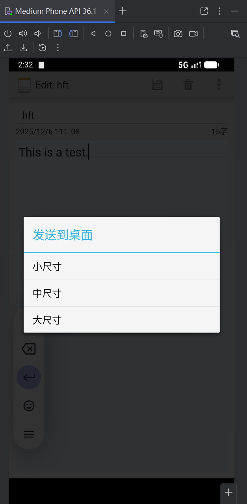

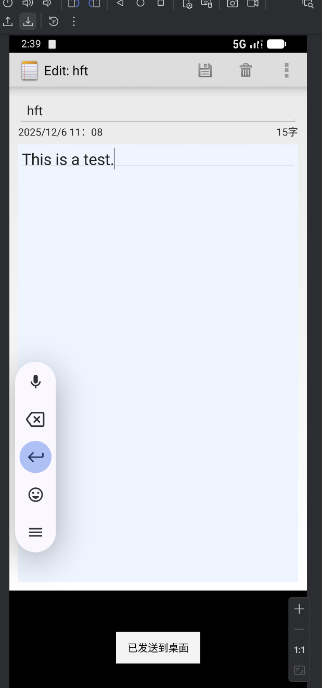

2. 在桌面长按屏幕，选择Widgets,搜索NotePad,点击add按钮,选择想添加的笔记便签，便可在手机桌面上显示

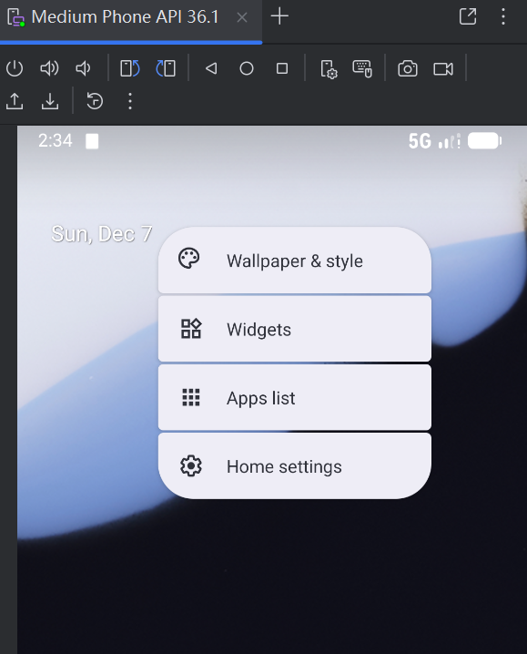

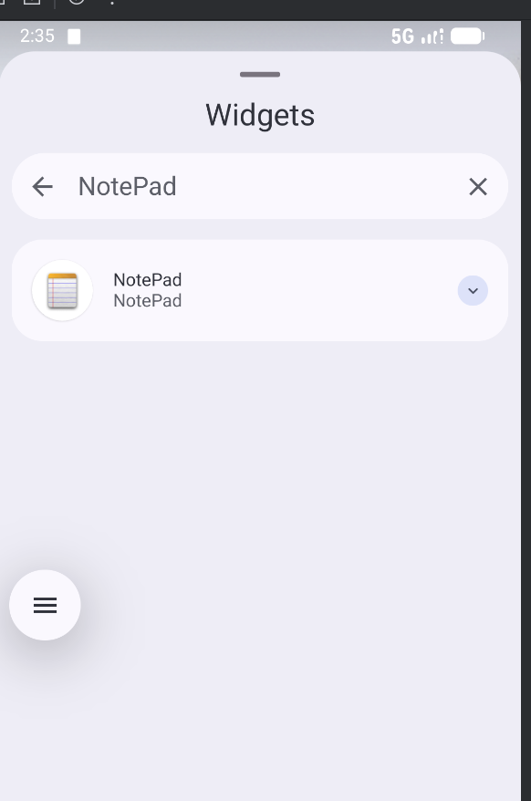

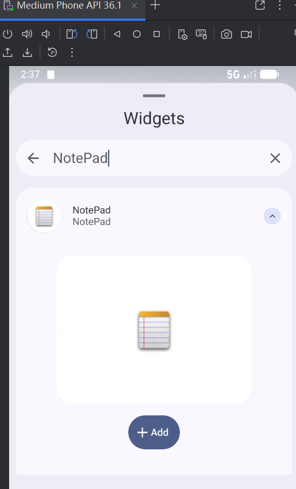

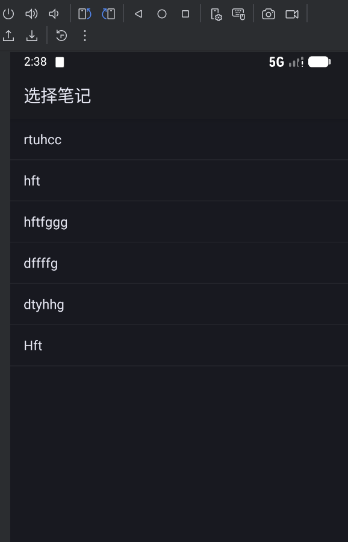

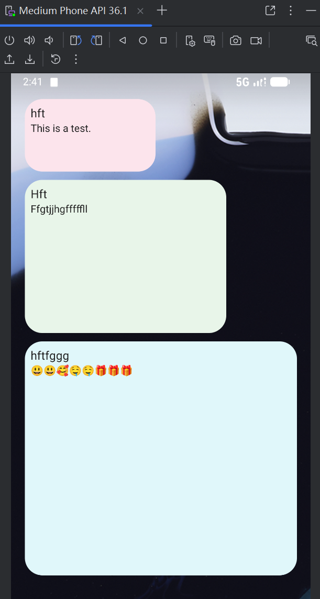

3. 长按笔记便签修改便签大小

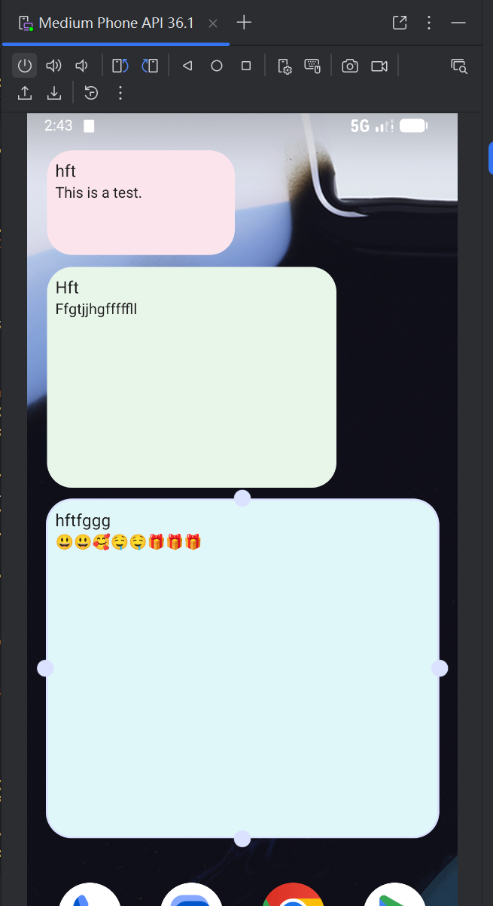

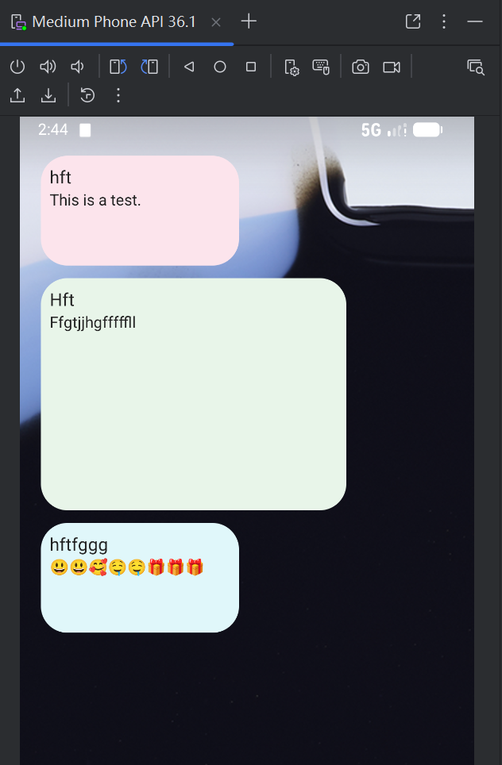

4. 点击笔记便签查看笔记内容

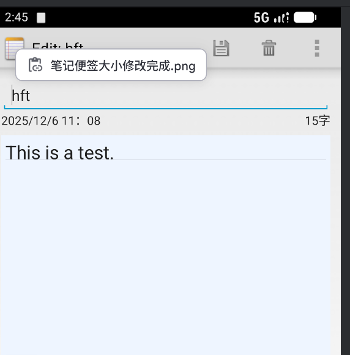


### 8、笔记按时提醒的设置与取消

(1)功能要求

用户可以对重要的笔记设置提醒时间，支持年月日时分的设置选择，如果用户选择的提醒时间已过期，则程序将提示用户所选时间已过期；如果所选的提醒时间未过期，程序将提示提醒时间设置成功。当提醒时间到时，程序将发送消息提醒用户，用户可以点击消息查看该笔记的详细内容。如果用户不需要提醒时，可以取消提醒时间，取消后到了提醒时间，程序也不会发送消息提醒用户。

(2)实现思路和核心代码

**实现思路**

- 数据持久化：在 Notes 表加入 reminder 列，保存提醒时间的毫秒值；清空或为过去时间视为无效

- 选择时间：编辑页弹出日期+时间选择器，预览选中时间（年月日时分），点击确定时校验是否过期

- 调度提醒：对未来时间使用 AlarmManager 精确调度；兼容 Doze 模式（API 23+ 使用 setAndAllowWhileIdle ）

- 发送通知：到时由 BroadcastReceiver 读取笔记标题/内容，发送通知；点击通知打开该笔记详情

- 取消提醒：清空 reminder 列并取消 AlarmManager 的 PendingIntent

- 重启恢复：设备重启后查询仍在未来的提醒并重新调度，避免丢失

**核心代码**

选择与校验提醒时间

- 日期+时间选择器，预览与过期判断： app/src/main/java/com/example/android/notepad/NoteEditor.java:951-1017

```java
new AlertDialog.Builder(this)
    .setTitle("设置提醒时间")
    .setView(container)
    .setNegativeButton("取消", (d, w) -> d.dismiss())
    .setPositiveButton("确定", (d, w) -> {
        long when = cal.getTimeInMillis();
        long now = System.currentTimeMillis();
        if (when <= now) {
            Toast.makeText(NoteEditor.this, "所选时间已过期", Toast.LENGTH_LONG).show();
        } else {
            scheduleNoteReminder(when);
            Toast.makeText(NoteEditor.this, "提醒时间设置成功", Toast.LENGTH_LONG).show();
        }
    })
    .show();
```

调度与取消提醒

- 设置提醒并调度：保存到数据库并设置闹钟，分版本精确调度： NoteEditor.java:1019-1039

```java
private void scheduleNoteReminder(long when) {
    long id = ContentUris.parseId(mUri);
    ContentValues values = new ContentValues();
    values.put(NotePad.Notes.COLUMN_NAME_REMINDER_MILLIS, when);
    getContentResolver().update(mUri, values, null, null);
    Intent i = new Intent(this, NoteReminderReceiver.class);
    i.setData(ContentUris.withAppendedId(NotePad.Notes.CONTENT_ID_URI_BASE, id));
    i.putExtra("note_id", id);
    PendingIntent pi = PendingIntent.getBroadcast(this, (int) id, i, PendingIntent.FLAG_UPDATE_CURRENT);
    AlarmManager am = (AlarmManager) getSystemService(Context.ALARM_SERVICE);
    if (android.os.Build.VERSION.SDK_INT >= 23) am.setAndAllowWhileIdle(AlarmManager.RTC_WAKEUP, when, pi);
    else if (android.os.Build.VERSION.SDK_INT >= 19) am.setExact(AlarmManager.RTC_WAKEUP, when, pi);
    else am.set(AlarmManager.RTC_WAKEUP, when, pi);
}
```

- 取消提醒：清空列并取消闹钟： NoteEditor.java:1041-1056

```java
private void clearNoteReminder() {
    long id = ContentUris.parseId(mUri);
    ContentValues values = new ContentValues();
    values.put(NotePad.Notes.COLUMN_NAME_REMINDER_MILLIS, 0);
    getContentResolver().update(mUri, values, null, null);
    Intent i = new Intent(this, NoteReminderReceiver.class);
    i.setData(ContentUris.withAppendedId(NotePad.Notes.CONTENT_ID_URI_BASE, id));
    i.putExtra("note_id", id);
    PendingIntent pi = PendingIntent.getBroadcast(this, (int) id, i, PendingIntent.FLAG_UPDATE_CURRENT);
    AlarmManager am = (AlarmManager) getSystemService(Context.ALARM_SERVICE);
    if (am != null) am.cancel(pi);
    Toast.makeText(this, "已清除提醒", Toast.LENGTH_LONG).show();
}
```

到时发送通知

- 广播接收并发送通知（点击查看详情）： app/src/main/java/com/example/android/notepad/NoteReminderReceiver.java:13-54

```java
public void onReceive(Context context, Intent intent) {
    long id = intent.getLongExtra("note_id", -1);
    String title = "笔记提醒", text = "";
    if (id != -1) {
        Uri uri = ContentUris.withAppendedId(NotePad.Notes.CONTENT_ID_URI_BASE, id);
        Cursor c = context.getContentResolver().query(uri,
            new String[]{ NotePad.Notes.COLUMN_NAME_TITLE, NotePad.Notes.COLUMN_NAME_NOTE }, null, null, null);
        if (c != null && c.moveToFirst()) { title = c.getString(c.getColumnIndex(NotePad.Notes.COLUMN_NAME_TITLE)); text = c.getString(c.getColumnIndex(NotePad.Notes.COLUMN_NAME_NOTE)); c.close(); }
    }
    Intent open = new Intent(context, NoteEditor.class);
    open.setAction(Intent.ACTION_EDIT);
    open.setData(ContentUris.withAppendedId(NotePad.Notes.CONTENT_ID_URI_BASE, id));
    PendingIntent content = PendingIntent.getActivity(context, (int) id, open, PendingIntent.FLAG_UPDATE_CURRENT);
    Notification.Builder builder = new Notification.Builder(context)
        .setSmallIcon(R.drawable.app_notes).setContentTitle(title).setContentText(text)
        .setAutoCancel(true).setContentIntent(content);
    builder.setDefaults(Notification.DEFAULT_ALL);
    ((NotificationManager) context.getSystemService(Context.NOTIFICATION_SERVICE)).notify((int) id, builder.build());
}
```

重启后恢复提醒

- 查询未来提醒并重新调度： app/src/main/java/com/example/android/notepad/NoteBootReceiver.java:11-50

```java
if (Intent.ACTION_BOOT_COMPLETED.equals(intent.getAction())) {
    long now = System.currentTimeMillis();
    Cursor c = context.getContentResolver().query(NotePad.Notes.CONTENT_URI,
        new String[]{ NotePad.Notes._ID, NotePad.Notes.COLUMN_NAME_REMINDER_MILLIS },
        NotePad.Notes.COLUMN_NAME_REMINDER_MILLIS + " > ?", new String[]{ String.valueOf(now) }, null);
    for (c.moveToFirst(); !c.isAfterLast(); c.moveToNext()) {
        long id = c.getLong(c.getColumnIndex(NotePad.Notes._ID));
        long when = c.getLong(c.getColumnIndex(NotePad.Notes.COLUMN_NAME_REMINDER_MILLIS));
        AlarmManager am = (AlarmManager) context.getSystemService(Context.ALARM_SERVICE);
        Intent i = new Intent(context, NoteReminderReceiver.class);
        i.setData(ContentUris.withAppendedId(NotePad.Notes.CONTENT_ID_URI_BASE, id));
        i.putExtra("note_id", id);
        PendingIntent pi = PendingIntent.getBroadcast(context, (int) id, i, PendingIntent.FLAG_UPDATE_CURRENT);
        if (android.os.Build.VERSION.SDK_INT >= 23) am.setAndAllowWhileIdle(AlarmManager.RTC_WAKEUP, when, pi);
        else if (android.os.Build.VERSION.SDK_INT >= 19) am.setExact(AlarmManager.RTC_WAKEUP, when, pi);
        else am.set(AlarmManager.RTC_WAKEUP, when, pi);
    }
}
```

**交互行为**

- 用户选择过期时间会提示“所选时间已过期”，不会保存或调度

- 选择未来时间保存并调度，提示“提醒时间设置成功”

- 到时发送通知，点击进入笔记编辑页查看详情

- 用户取消提醒后，数据库清空该笔记的 reminder 值并取消闹钟，之后不会再收到该提醒

- 设备重启后仍会恢复所有未过期的提醒，保证可靠性

(3)操作流程及实现效果截图

1. 点击任意一条笔记，点击笔记内右上角三个点图标按钮，选择Set reminder按钮，进入设置提醒时间页面

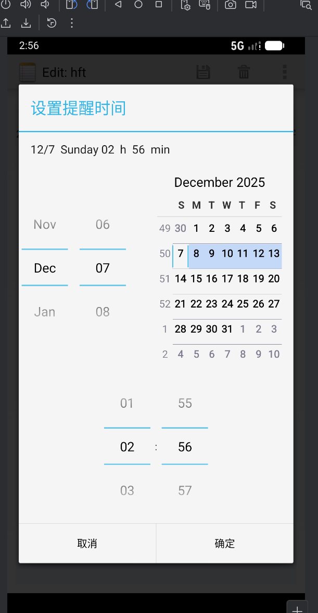

2. 选择合适的提醒时间，点击确定便设置成功，如果用户选择的时间已过期，则程序将提示所选时间已过期

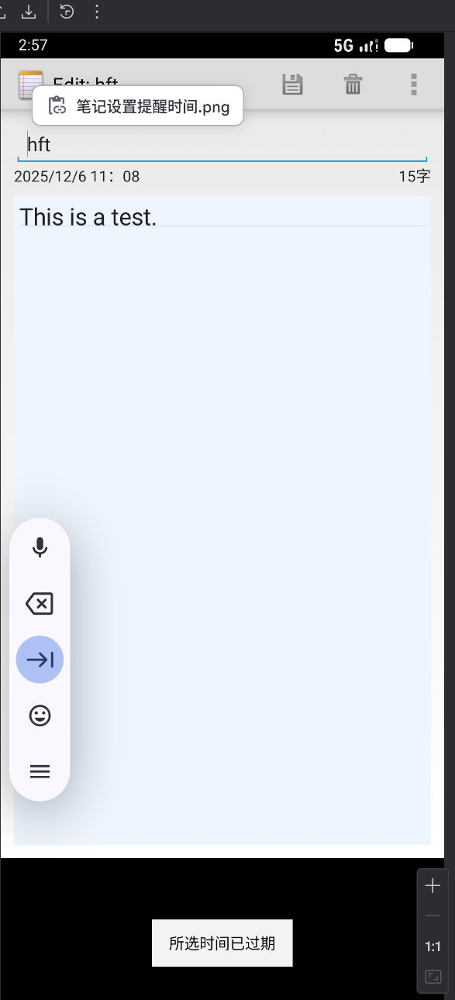

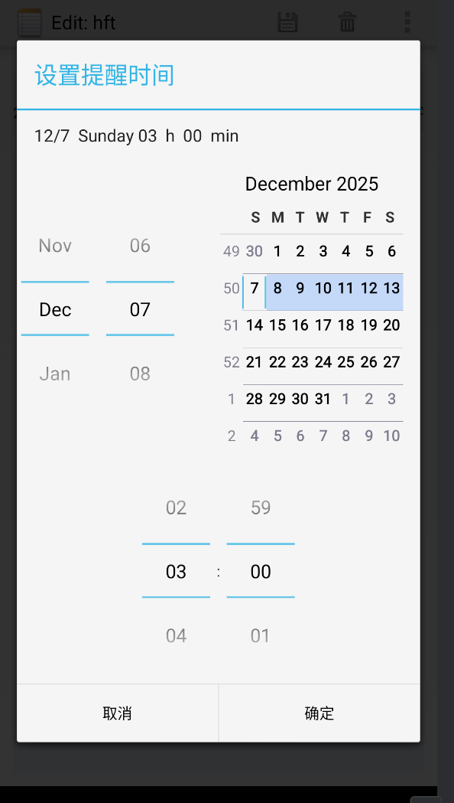

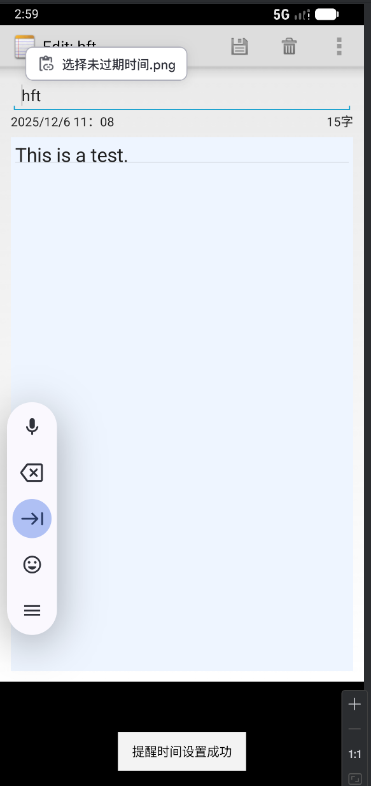

3. 到了提醒时间，程序将发送消息提醒用户，用户可以点击消息查看该笔记的详细内容

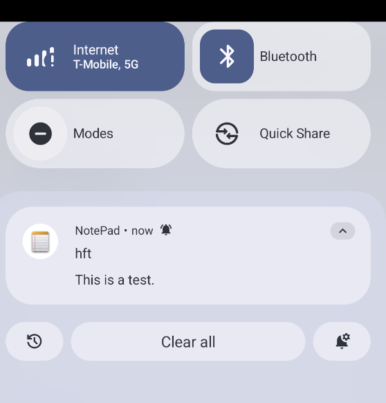

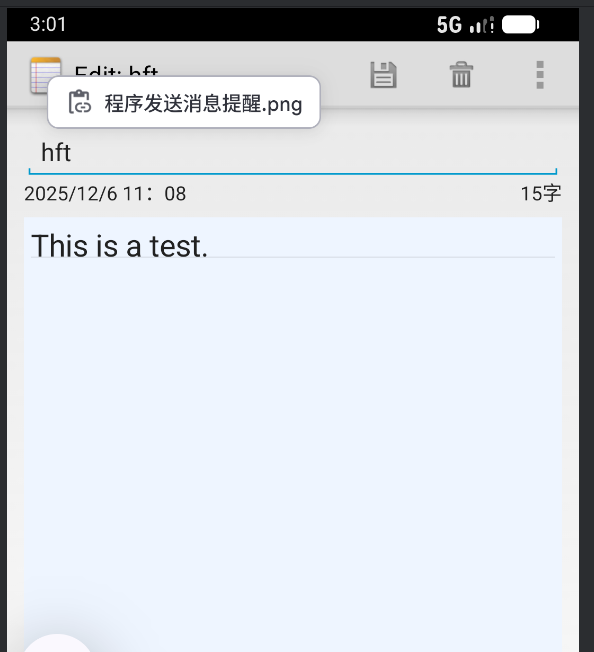

4. 如果用户点击笔记内右上角三个点图标按钮，选择Clear reminder按钮，便取消了该笔记的提醒时间，到了提醒时间后程序将不会发送消息提醒用户

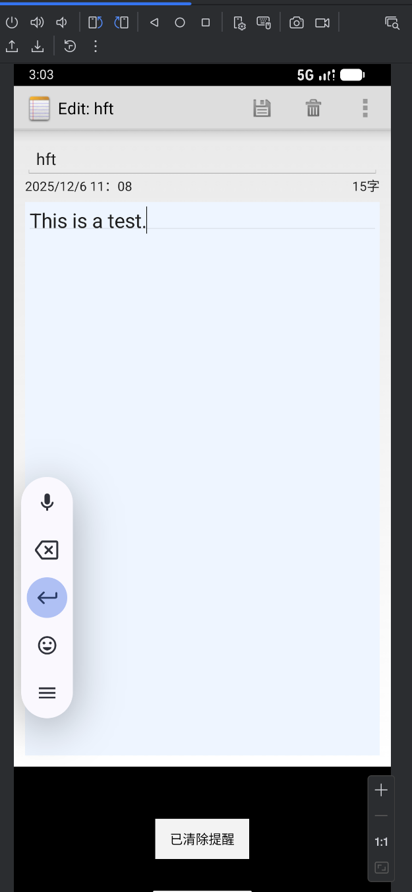


## 四、 项目总结

### 1、遇到的问题及解决办法

在项目实现过程中，遇到了许多问题，下面进行详细介绍：

(1)点击查看笔记内容而不做出任何修改操作，笔记显示的时间戳会进行相应的改变

解决办法: 更改笔记查看时程序相应的逻辑，只有在修改完内容点击保存按钮后才能对时间戳进行修改成当前操作完成时间，仅查看不会改变时间。

(2)Gradle版本与JDK版本不兼容，导致运行报错，程序无法启动

解决办法: 更换Gradle版本或更换JDK版本，使其相互兼容。

(3)使用的笔记数据库中，COLUMN_NAME_REMINDER_MILLIS字段为long类型，但程序中设置的时间戳为String类型，导致程序无法保存提醒时间，程序崩溃

解决办法: 统一使用long类型保存时间戳，程序中将时间戳转换成String类型保存在COLUMN_NAME_REMINDER_MILLIS字段中。

(4)使用的数据库版本太低，导致程序刚运行起来就马上闪退

解决办法: 升级数据库版本，程序运行正常。

(5)设置了提醒时间且程序代码没有问题，但程序没有发送提醒消息

解决办法:检查手机设置中是否打开了通知权限，如果没有打开，则打开，打开后手机便能接收到提醒消息。

### 2、项目不足与改进建议

**不足**

架构与代码质量

- 数据操作在主线程阻塞 UI，易卡顿与 ANR；应使用异步查询或 Room/LiveData

- 大量使用已废弃 API，如 managedQuery 、 Cursor.requery ，应迁移到 Loader / ContentObserver 或 Room

- 直接操作 SimpleCursorAdapter 和原始 SQL，缺少仓储层与单元测试，维护难度大

- Provider 的 authority 使用示例名 com.google.provider.NotePad ，不唯一且不规范，易与其他 App 冲突

兼容性与API使用

- 通知未创建 NotificationChannel ，在 Android 8+ 可能不显示提醒；应为不同渠道创建频道

- 快捷方式使用 INSTALL_SHORTCUT 广播，已废弃；应改用 ShortcutManager.requestPinShortcut

- PendingIntent 缺少 FLAG_IMMUTABLE / FLAG_MUTABLE 适配 Android 12+，存在兼容风险

- 编辑页主题为 Theme.Holo.Light ，与现代 Material 设计不一致

安全与隐私

- Provider exported="true" 且 grant-uri-permission 使用通配模式，数据暴露面过大；应收紧权限与授权范围

- 未见对外部输入进行严格校验（搜索/导出/Widget 文本绘制），超长内容可能导致内存峰值或 UI 溢出

提醒与可靠性

- 仅在开机后恢复提醒，未处理时区变更/系统时间调整等事件，可能导致提醒偏移

- 取消与更新提醒的覆盖场景有限（笔记编辑时有覆盖，但列表层与批量操作的边界场景需要统一抽象）

- 使用 AlarmManager 一次性提醒，缺少重复提醒、延后（snooze）等增强功能

桌面与 Widget

- Widget 支持缩放但未实现 onAppWidgetOptionsChanged 自适应布局/字号，缩放体验有限

- 快捷方式图标用位图绘制文本，长文/多语言可能截断或影响可读性；未根据图标大小动态裁剪

国际化与体验

- 文案与时间格式中英文混用，且存在全角冒号（ HH：mm ）等不统一格式

- 列表卡片颜色虽友好，但未考虑深色模式对比度与无障碍可读性

**改进建议**

- 引入 Room + ViewModel + LiveData，替换 managedQuery / requery ，将数据库与提醒调度迁移到后台线程

- 为通知创建 NotificationChannel ，并统一封装提醒调度与取消接口，兼容 Android 12+ PendingIntent 旗标

- 替换桌面快捷方式为 ShortcutManager ，并完善 Widget 缩放自适应（字号、最大行数）

- 收紧 Provider 暴露与授权策略，使用应用唯一 authority ，并增加访问控制

- 完善时间事件处理（时区/时间变更广播），并考虑增强提醒功能（重复、推迟）

- 统一国际化与格式化策略，按系统区域输出，并优化深色模式与无障碍对比度

### 3、项目优点

- 该项目以简洁稳健的架构实现了笔记与待办的核心场景，并在提醒、导出、桌面集成、主题与布局等方面提供了完善的用户体验

- 数据驱动 + 组件化设计，使功能增量（如置顶、提醒、桌面便签）在不破坏主流程的前提下自然融入

- 代码遵循 Android 经典模式，易读、易扩展，适合作为学习 ContentProvider、AlarmManager、Widgets 与高质量列表交互的参考实现